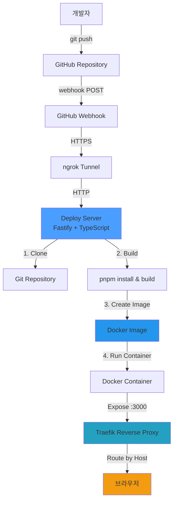
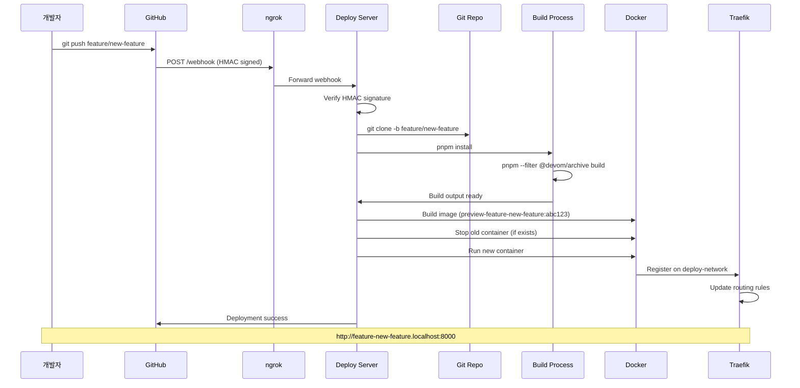

# GitHub Webhook 배포 파이프라인

자동화된 GitHub webhook 기반 브랜치별 preview 배포 시스템 구축 가이드

## 개요

이 문서는 GitHub webhook을 활용한 자동 배포 파이프라인의 아키텍처와 설정 방법을 설명합니다. 코드를 GitHub에 push하면 자동으로 빌드되고 Docker 컨테이너로 배포되어 브랜치별 preview 환경을 제공합니다.

## 아키텍처



## 구성 요소

### 1. GitHub Webhook
- **역할**: Push 이벤트를 deploy-server로 전송
- **URL**: ngrok public URL + `/webhook`
- **인증**: HMAC SHA-256 서명 검증
- **Payload**: 브랜치명, 커밋 정보 등

### 2. ngrok
- **역할**: 로컬 deploy-server를 인터넷에 노출
- **포트**: 3000 → public HTTPS URL
- **용도**: GitHub webhook을 로컬 개발 환경에서 수신

### 3. Deploy Server
- **기술 스택**: Fastify, TypeScript, tsx
- **주요 기능**:
  - Webhook 수신 및 검증
  - Git clone & checkout
  - pnpm install & build
  - Docker 이미지 빌드
  - 컨테이너 관리
- **빌드 큐**: p-queue로 동시 빌드 제어 (기본 3개)

### 4. Docker
- **이미지 생성**:
  - Next.js standalone 모드 사용
  - Node.js 20 Alpine 베이스
  - 정적 파일 포함
- **컨테이너 네이밍**: `preview-{branch-name}`
- **이미지 태그**: `{container-name}:{commit-hash}`

### 5. Traefik
- **역할**: 역방향 프록시 및 라우팅
- **라우팅 규칙**: Host 헤더 기반
  - `{branch-name}.localhost:8000` → 해당 브랜치 컨테이너
- **네트워크**: `deploy-network` (Docker bridge)

## 배포 플로우



## 상세 배포 과정

### 1. Webhook 수신 (Deploy Server)

```typescript
// 1. HMAC 서명 검증
const signature = req.headers['x-hub-signature-256']
const valid = verifyWebhookSignature(payload, signature, WEBHOOK_SECRET)

// 2. 브랜치 필터링
if (ref !== `refs/heads/${branchName}`) return

// 3. 배포 큐에 추가
await buildQueue.add(() => deployBranch(branchName, commitHash))
```

### 2. Git Clone & Build

```bash
# Clone repository
git clone -b {branch-name} --depth 1 {repo-url} {workspace}

# Install dependencies
cd {workspace}
pnpm install

# Build project
pnpm --filter @devom/archive build
```

### 3. Dockerfile 생성 (Next.js Standalone)

```dockerfile
FROM node:20-alpine

WORKDIR /app

# Copy standalone server
COPY apps/archive/.next/standalone ./

# Copy static files (중요: 경로 보존)
COPY apps/archive/.next/static ./apps/archive/.next/static

# Copy public files
COPY apps/archive/public ./apps/archive/public

ENV NODE_ENV production
ENV PORT 3000
ENV HOSTNAME "0.0.0.0"

EXPOSE 3000

HEALTHCHECK --interval=30s --timeout=3s --start-period=5s --retries=3 \
  CMD wget --quiet --tries=1 --spider http://127.0.0.1:3000/ || exit 1

CMD ["node", "apps/archive/server.js"]
```

### 4. Docker 이미지 빌드 & 실행

```typescript
// Build image
await docker.buildImage({
  context: workspaceDir,
  src: ['Dockerfile', 'apps/'],
  t: `${containerName}:${commitHash}`
})

// Stop old container
await oldContainer?.stop()
await oldContainer?.remove()

// Start new container
await docker.createContainer({
  Image: `${containerName}:${commitHash}`,
  name: containerName,
  Labels: {
    'traefik.enable': 'true',
    'traefik.http.routers.{name}.rule': `Host(\`{branch}.localhost\`)`,
    'traefik.http.services.{name}.loadbalancer.server.port': '3000'
  },
  HostConfig: {
    NetworkMode: 'deploy-network'
  }
})

await container.start()
```

### 5. Traefik 자동 라우팅

Traefik은 Docker 컨테이너의 라벨을 감지하여 자동으로 라우팅 규칙을 업데이트합니다:

```yaml
# docker-compose.yml
services:
  traefik:
    image: traefik:v2.10
    command:
      - "--providers.docker=true"
      - "--providers.docker.exposedbydefault=false"
      - "--providers.docker.network=deploy-network"
      - "--entrypoints.web.address=:8000"
    ports:
      - "8000:8000"
    volumes:
      - "/var/run/docker.sock:/var/run/docker.sock:ro"
    networks:
      - deploy-network
```

## 설정 가이드

### 1. 환경 변수 설정 (.env)

```bash
# GitHub Webhook Secret (Settings > Webhooks에서 설정한 값)
GITHUB_WEBHOOK_SECRET=your_webhook_secret_here

# Git Repository SSH URL
REPO_SSH_URL=git@github.com:username/repo.git

# 작업 디렉토리
WORK_DIR=/tmp/deploy/workspace

# 베이스 도메인
BASE_DOMAIN=localhost

# 기본 브랜치
DEFAULT_BRANCH=main

# 허용할 브랜치 패턴 (정규식)
ALLOWED_BRANCH_REGEX=^(feature|fix|test)/.*$

# 빌드 큐 동시성
BUILD_CONCURRENCY=3

# 서버 포트
PORT=3000
```

### 2. ngrok 시작

```bash
ngrok http 3000
```

출력에서 public URL 확인 (예: `https://abc123.ngrok-free.dev`)

### 3. GitHub Webhook 설정

1. GitHub 저장소 → Settings → Webhooks → Add webhook
2. **Payload URL**: `{ngrok-url}/webhook` (예: `https://abc123.ngrok-free.dev/webhook`)
3. **Content type**: `application/json`
4. **Secret**: `.env`의 `GITHUB_WEBHOOK_SECRET`와 동일한 값
5. **Events**: "Just the push event" 선택
6. **Active** 체크
7. Add webhook 클릭

### 4. Traefik 시작

```bash
cd deploy-server
docker-compose up -d
```

### 5. Deploy Server 시작

```bash
cd deploy-server
pnpm install
pnpm dev
```

## 접속 방법

브랜치별 preview URL 형식:

```
http://{branch-name}.localhost:8000
```

예시:
- `feature/test-webhook-deploy` → `http://feature-test-webhook-deploy.localhost:8000`
- `fix/button-bug` → `http://fix-button-bug.localhost:8000`

## 트러블슈팅

### 1. Webhook이 전송되지 않음

**증상**: GitHub에서 webhook을 보내지만 deploy-server에 도착하지 않음

**원인**:
- ngrok이 종료됨
- ngrok URL이 변경됨 (무료 플랜은 재시작 시 URL 변경)

**해결**:
```bash
# ngrok 상태 확인
curl http://localhost:4040/api/tunnels

# ngrok 재시작
ngrok http 3000

# GitHub webhook URL 업데이트
# Settings > Webhooks에서 새 ngrok URL로 변경
```

### 2. 빌드 실패: TypeScript 에러

**증상**: `Type error: 'variable' is declared but its value is never read`

**해결**:
```typescript
// 사용하지 않는 변수에 언더스코어 접두사 추가
const { used, unused: _unused } = obj
```

### 3. 정적 파일 404 에러

**증상**: HTML은 로드되지만 JS/CSS 파일이 404

**원인**: Next.js standalone 모드에서 정적 파일 경로가 잘못됨

**해결**: Dockerfile에서 경로 보존
```dockerfile
# ❌ 잘못된 경로
COPY apps/archive/.next/static ./.next/static

# ✅ 올바른 경로 (앱 디렉토리 구조 유지)
COPY apps/archive/.next/static ./apps/archive/.next/static
```

### 4. Container가 시작되지 않음

**증상**: Docker 이미지는 빌드되지만 컨테이너가 unhealthy

**확인 사항**:
```bash
# 컨테이너 로그 확인
docker logs preview-{branch-name}

# 헬스체크 상태
docker inspect preview-{branch-name} | grep -A 10 Health

# 수동으로 컨테이너 접속
docker exec -it preview-{branch-name} sh
```

### 5. Traefik 라우팅 안됨

**증상**: 컨테이너는 실행 중이지만 브라우저에서 접속 불가

**확인 사항**:
```bash
# Traefik 대시보드 확인 (활성화된 경우)
open http://localhost:8080

# 컨테이너 네트워크 확인
docker inspect preview-{branch-name} | grep -A 5 Networks

# Traefik 로그
docker logs deploy-server-traefik-1
```

**해결**: 컨테이너 라벨 확인
```bash
docker inspect preview-{branch-name} | grep -A 10 Labels
```

필수 라벨:
- `traefik.enable=true`
- `traefik.http.routers.{name}.rule=Host(...)`
- `traefik.http.services.{name}.loadbalancer.server.port=3000`

## 성능 최적화

### 1. 빌드 캐싱

pnpm의 store를 공유하여 의존성 설치 시간 단축:

```typescript
// deploy-server/src/utils/build.ts
const SHARED_PNPM_STORE = '/tmp/deploy/.pnpm-store'

await execAsync('pnpm install', {
  cwd: workspaceDir,
  env: {
    ...process.env,
    PNPM_HOME: SHARED_PNPM_STORE
  }
})
```

### 2. 빌드 큐 동시성 조정

`.env`에서 `BUILD_CONCURRENCY` 조정:
- 낮은 값 (1-2): CPU/메모리 제한된 환경
- 높은 값 (3-5): 충분한 리소스가 있는 환경

### 3. Docker 이미지 최적화

- Alpine 베이스 이미지 사용 (크기 감소)
- Multi-stage build (불필요한 파일 제거)
- Layer 캐싱 활용

## 보안 고려사항

### 1. Webhook 서명 검증

모든 webhook 요청은 HMAC SHA-256 서명을 검증합니다:

```typescript
function verifyWebhookSignature(payload: string, signature: string, secret: string): boolean {
  const hmac = crypto.createHmac('sha256', secret)
  const digest = 'sha256=' + hmac.update(payload).digest('hex')
  return crypto.timingSafeEqual(Buffer.from(signature), Buffer.from(digest))
}
```

### 2. 브랜치 필터링

`ALLOWED_BRANCH_REGEX`로 허용된 브랜치만 배포:

```typescript
const branchRegex = new RegExp(config.ALLOWED_BRANCH_REGEX)
if (!branchRegex.test(branchName)) {
  return // 배포 거부
}
```

### 3. 리소스 제한

Docker 컨테이너에 리소스 제한 설정:

```typescript
HostConfig: {
  Memory: 512 * 1024 * 1024, // 512MB
  NanoCpus: 1000000000, // 1 CPU
}
```

## 모니터링

### 배포 로그

Deploy server는 구조화된 로그를 출력합니다:

```
[info] Webhook received: push (delivery: abc-123)
[info] Push event received for branch: feature/test
[info] [preview-feature-test] Starting deployment
[info] Cloning repository branch feature/test
[info] Repository cloned successfully
[info] Building project
[info] Build completed successfully in 8745ms
[info] Building Docker image: preview-feature-test:a1b2c3d
[info] Docker image built successfully
[info] Container started: preview-feature-test
[info] [preview-feature-test] Deployment completed successfully
[info] [preview-feature-test] URL: http://feature-test.localhost
```

### 에러 추적

빌드 실패 시 전체 스택 트레이스가 로그에 기록됩니다:

```
[error] [preview-feature-test] Deployment failed: Build failed: Command failed
[error] Error handling webhook: Build failed: ...
```

## 로컬 vs 프로덕션 배포

### 현재 구성 (로컬 개발/테스트)

```
로컬 머신 (개발자 PC)
├── deploy-server (Node.js 프로세스, pnpm dev)
├── ngrok (임시 터널)
├── Docker (컨테이너 실행)
└── Traefik (localhost 프록시)

GitHub webhook → ngrok → localhost:3000 → deploy-server
```

**특징**:
- ✅ 빠른 테스트 및 개발
- ✅ 별도 서버 불필요
- ❌ 임시 ngrok URL (재시작 시 변경)
- ❌ PC가 켜져있어야 함
- ❌ 프로덕션 용도 부적합

### 프로덕션 배포 (실제 서버)

```
클라우드 서버 (VPS, EC2, DigitalOcean 등)
├── deploy-server (PM2/systemd로 상시 실행)
├── 고정 IP + 도메인 (ngrok 불필요)
├── Docker (컨테이너 실행)
└── Traefik (실제 도메인 라우팅 + SSL)

GitHub webhook → deploy.yourdomain.com → 서버:3000 → deploy-server
```

**특징**:
- ✅ 24/7 가용성
- ✅ 고정 도메인/IP
- ✅ HTTPS/SSL 지원
- ✅ 프로덕션 용도
- ❌ 서버 비용 발생

## Deploy Server 프로덕션 배포 가이드

### 전제 조건

- Ubuntu/Debian 기반 VPS (DigitalOcean, AWS EC2, Linode 등)
- 루트 또는 sudo 권한
- 도메인 이름 (예: `yourdomain.com`)
- GitHub 계정 및 저장소

### 1. 서버 준비

#### 1.1 서버 접속

```bash
ssh root@your-server-ip
```

#### 1.2 시스템 업데이트

```bash
apt update && apt upgrade -y
```

#### 1.3 필수 패키지 설치

```bash
# Node.js 20.x 설치
curl -fsSL https://deb.nodesource.com/setup_20.x | bash -
apt install -y nodejs

# pnpm 설치
npm install -g pnpm

# Docker 설치
curl -fsSL https://get.docker.com | sh
systemctl enable docker
systemctl start docker

# Docker Compose 설치
apt install -y docker-compose

# Git 설치
apt install -y git

# PM2 설치 (프로세스 관리)
npm install -g pm2
```

#### 1.4 사용자 생성 (보안을 위해 root 대신 사용)

```bash
adduser deploy
usermod -aG sudo deploy
usermod -aG docker deploy

# deploy 유저로 전환
su - deploy
```

### 2. 저장소 클론 및 설정

```bash
cd ~
git clone git@github.com:username/devom.git
cd devom/deploy-server
```

#### 2.1 SSH 키 생성 (Git clone용)

```bash
ssh-keygen -t ed25519 -C "deploy@server"
cat ~/.ssh/id_ed25519.pub
```

GitHub Settings → SSH keys에 공개키 추가

#### 2.2 의존성 설치

```bash
pnpm install
```

#### 2.3 환경 변수 설정

```bash
cp .env.example .env
nano .env
```

프로덕션용 `.env` 설정:

```bash
# GitHub Webhook Secret
GITHUB_WEBHOOK_SECRET=your_production_webhook_secret

# Git Repository SSH URL
REPO_SSH_URL=git@github.com:username/devom.git

# 작업 디렉토리
WORK_DIR=/home/deploy/deploy-workspace

# 베이스 도메인 (실제 도메인으로 변경)
BASE_DOMAIN=preview.yourdomain.com

# 기본 브랜치
DEFAULT_BRANCH=main

# 허용할 브랜치 패턴
ALLOWED_BRANCH_REGEX=^(feature|fix|hotfix|test)/.*$

# 빌드 큐 동시성
BUILD_CONCURRENCY=3

# 서버 포트
PORT=3000

# 프로덕션 모드
NODE_ENV=production
```

#### 2.4 작업 디렉토리 생성

```bash
mkdir -p /home/deploy/deploy-workspace
```

### 3. Traefik 설정 (프로덕션용)

#### 3.1 docker-compose.yml 수정

```bash
nano docker-compose.yml
```

프로덕션용 설정:

```yaml
version: '3.8'

services:
  traefik:
    image: traefik:v2.10
    container_name: traefik
    restart: unless-stopped
    command:
      # Docker 프로바이더
      - "--providers.docker=true"
      - "--providers.docker.exposedbydefault=false"
      - "--providers.docker.network=deploy-network"

      # 엔트리포인트
      - "--entrypoints.web.address=:80"
      - "--entrypoints.websecure.address=:443"

      # HTTP → HTTPS 리다이렉트
      - "--entrypoints.web.http.redirections.entrypoint.to=websecure"
      - "--entrypoints.web.http.redirections.entrypoint.scheme=https"

      # Let's Encrypt 자동 SSL
      - "--certificatesresolvers.letsencrypt.acme.tlschallenge=true"
      - "--certificatesresolvers.letsencrypt.acme.email=your@email.com"
      - "--certificatesresolvers.letsencrypt.acme.storage=/letsencrypt/acme.json"

      # 대시보드 (선택사항)
      - "--api.dashboard=true"
      - "--api.insecure=false"

    ports:
      - "80:80"
      - "443:443"
      # - "8080:8080"  # 대시보드 (필요시 주석 해제)

    volumes:
      - "/var/run/docker.sock:/var/run/docker.sock:ro"
      - "./letsencrypt:/letsencrypt"

    networks:
      - deploy-network

    labels:
      # 대시보드 라우팅 (선택사항)
      - "traefik.enable=true"
      - "traefik.http.routers.dashboard.rule=Host(`traefik.yourdomain.com`)"
      - "traefik.http.routers.dashboard.entrypoints=websecure"
      - "traefik.http.routers.dashboard.tls.certresolver=letsencrypt"
      - "traefik.http.routers.dashboard.service=api@internal"
      - "traefik.http.routers.dashboard.middlewares=auth"

      # 기본 인증 (ID: admin, PW: 생성 필요)
      - "traefik.http.middlewares.auth.basicauth.users=admin:$$apr1$$..."

networks:
  deploy-network:
    name: deploy-network
    driver: bridge
```

#### 3.2 Basic Auth 비밀번호 생성 (대시보드용)

```bash
# htpasswd 설치
sudo apt install apache2-utils

# 비밀번호 생성
htpasswd -nb admin your_password
# 출력: admin:$apr1$...

# docker-compose.yml의 basicauth.users에 복사 ($ 기호는 $$ 로 이스케이프)
```

#### 3.3 Traefik 시작

```bash
docker-compose up -d
```

### 4. PM2로 Deploy Server 실행

#### 4.1 PM2 Ecosystem 파일 생성

```bash
nano ecosystem.config.js
```

```javascript
module.exports = {
  apps: [{
    name: 'deploy-server',
    script: 'node_modules/.bin/tsx',
    args: 'src/server.ts',
    cwd: '/home/deploy/devom/deploy-server',
    instances: 1,
    autorestart: true,
    watch: false,
    max_memory_restart: '512M',
    env: {
      NODE_ENV: 'production'
    },
    error_file: './logs/err.log',
    out_file: './logs/out.log',
    log_date_format: 'YYYY-MM-DD HH:mm:ss Z',
    merge_logs: true
  }]
}
```

#### 4.2 로그 디렉토리 생성

```bash
mkdir -p logs
```

#### 4.3 PM2로 시작

```bash
pm2 start ecosystem.config.js
```

#### 4.4 PM2 상태 확인

```bash
pm2 status
pm2 logs deploy-server
```

#### 4.5 시스템 재부팅 시 자동 시작

```bash
pm2 startup
# 출력된 명령어 실행 (sudo로 시작)

pm2 save
```

### 5. DNS 설정

도메인 DNS 레코드 추가:

#### 5.1 A 레코드

```
호스트: @
타입: A
값: your-server-ip
TTL: 3600
```

#### 5.2 와일드카드 A 레코드 (Preview 환경용)

```
호스트: *.preview
타입: A
값: your-server-ip
TTL: 3600
```

#### 5.3 결과

- `yourdomain.com` → 서버 IP
- `feature-xyz.preview.yourdomain.com` → 서버 IP (Traefik이 라우팅)

### 6. GitHub Webhook 설정

#### 6.1 Webhook URL 업데이트

GitHub 저장소 → Settings → Webhooks → 기존 webhook 편집

**Payload URL**: `https://yourdomain.com/webhook`

> ⚠️ ngrok URL에서 실제 도메인으로 변경!

#### 6.2 SSL 검증

"Enable SSL verification" 체크

#### 6.3 테스트

"Recent Deliveries"에서 "Redeliver" 클릭하여 테스트

### 7. 방화벽 설정 (UFW)

```bash
# UFW 설치
sudo apt install ufw

# 기본 정책: 모든 incoming 거부, outgoing 허용
sudo ufw default deny incoming
sudo ufw default allow outgoing

# SSH 허용 (연결 끊김 방지!)
sudo ufw allow ssh

# HTTP, HTTPS 허용
sudo ufw allow 80/tcp
sudo ufw allow 443/tcp

# UFW 활성화
sudo ufw enable

# 상태 확인
sudo ufw status
```

### 8. 배포 테스트

#### 8.1 브랜치 push

```bash
git checkout -b feature/test-production
git commit --allow-empty -m "test: production deployment"
git push origin feature/test-production
```

#### 8.2 로그 확인

```bash
# Deploy server 로그
pm2 logs deploy-server

# Docker 컨테이너 확인
docker ps

# Traefik 로그
docker logs traefik
```

#### 8.3 브라우저 접속

```
https://feature-test-production.preview.yourdomain.com
```

### 9. 모니터링 및 유지보수

#### 9.1 PM2 모니터링

```bash
pm2 monit
```

#### 9.2 로그 로테이션

```bash
pm2 install pm2-logrotate
pm2 set pm2-logrotate:max_size 10M
pm2 set pm2-logrotate:retain 7
```

#### 9.3 Docker 이미지 정리

오래된 이미지 자동 정리:

```bash
# 크론탭 설정
crontab -e

# 매일 새벽 3시에 사용하지 않는 이미지 삭제
0 3 * * * docker image prune -a -f --filter "until=168h"
```

#### 9.4 디스크 사용량 모니터링

```bash
# 전체 디스크 사용량
df -h

# Docker 사용량
docker system df

# 작업 디렉토리 사용량
du -sh /home/deploy/deploy-workspace
```

### 10. 보안 강화

#### 10.1 SSH 키 기반 인증

```bash
sudo nano /etc/ssh/sshd_config
```

```
PasswordAuthentication no
PubkeyAuthentication yes
```

```bash
sudo systemctl restart sshd
```

#### 10.2 Fail2Ban 설치

```bash
sudo apt install fail2ban
sudo systemctl enable fail2ban
sudo systemctl start fail2ban
```

#### 10.3 환경 변수 파일 권한

```bash
chmod 600 /home/deploy/devom/deploy-server/.env
```

### 11. 백업 전략

#### 11.1 환경 변수 백업

```bash
# 안전한 위치에 .env 백업
cp .env ~/.env.backup
chmod 600 ~/.env.backup
```

#### 11.2 자동 백업 스크립트

```bash
nano ~/backup.sh
```

```bash
#!/bin/bash
DATE=$(date +%Y%m%d-%H%M%S)
BACKUP_DIR=/home/deploy/backups

mkdir -p $BACKUP_DIR

# 환경 변수 백업
cp /home/deploy/devom/deploy-server/.env $BACKUP_DIR/env-$DATE

# Docker 이미지 목록 백업
docker images > $BACKUP_DIR/docker-images-$DATE.txt

# 7일 이상 된 백업 삭제
find $BACKUP_DIR -type f -mtime +7 -delete

echo "Backup completed: $DATE"
```

```bash
chmod +x ~/backup.sh

# 매일 새벽 2시 백업
crontab -e
0 2 * * * /home/deploy/backup.sh
```

## 비용 예상

### VPS 제공업체별 예상 비용

| 제공업체 | 플랜 | CPU | RAM | 스토리지 | 월 비용 |
|---------|------|-----|-----|----------|---------|
| DigitalOcean | Basic | 1 vCPU | 2GB | 50GB SSD | $12 |
| Linode | Shared CPU | 1 Core | 2GB | 50GB SSD | $12 |
| Vultr | Regular Performance | 1 vCPU | 2GB | 55GB SSD | $12 |
| Hetzner | CX21 | 2 vCPU | 4GB | 40GB SSD | €5.83 (~$6) |
| AWS EC2 | t3.small | 2 vCPU | 2GB | 30GB EBS | ~$17 |

### 추가 비용

- **도메인**: $10-15/년 (Namecheap, Cloudflare 등)
- **SSL**: 무료 (Let's Encrypt)
- **대역폭**: 대부분 플랜에 포함 (1-2TB/월)

### 권장 사항

초기 테스트 및 소규모 팀:
- **Hetzner CX21**: 가장 저렴하고 성능 좋음
- **DigitalOcean Basic**: 문서화 우수, 초보자 친화적

프로덕션:
- **DigitalOcean/Linode**: 안정성과 지원
- **AWS EC2**: 확장성 필요 시

## 관련 파일

```
devom/
├── deploy-server/
│   ├── src/
│   │   ├── server.ts              # Fastify 서버 & webhook 핸들러
│   │   ├── config.ts               # 환경 변수 검증
│   │   ├── utils/
│   │   │   ├── git.ts             # Git clone 유틸리티
│   │   │   ├── build.ts           # pnpm build 유틸리티
│   │   │   └── docker.ts          # Docker 이미지 빌드 & 실행
│   ├── docker-compose.yml          # Traefik 설정
│   ├── .env.example                # 환경 변수 템플릿
│   └── package.json
└── apps/
    └── archive/                    # 배포 대상 앱
        ├── next.config.js          # output: 'standalone'
        └── src/
```

## 결론

이 GitHub webhook 기반 배포 파이프라인은 다음과 같은 장점을 제공합니다:

✅ **자동화**: git push만으로 자동 배포
✅ **브랜치별 Preview**: 각 브랜치마다 독립적인 환경
✅ **빠른 피드백**: 5-15초 내 배포 완료
✅ **안정성**: HMAC 검증, 헬스체크, 자동 롤백
✅ **확장성**: 큐 기반 빌드, 리소스 제한

프로덕션 환경으로 확장하려면 ngrok 제거, HTTPS 적용, 도메인 설정 등의 추가 작업이 필요합니다.
